# Design: Monovella Connected-Care Vertical Slice

Originally generated by /office-hours on 2026-09-08. Rewritten 2026-09-14 to
realign with `docs/product/PRODUCT_SPEC.md` after several founder decisions
(public discovery, Nomba sub-account settlement, the Alerts/automatic-recovery
Must-Have) were folded into the spec. This rewrite is a direct content sync
against the now-authoritative `docs/product/*.md`, not a fresh CEO/Eng/Design
review cycle; see GSTACK REVIEW REPORT at the end for what actually ran and
when.

Status: APPROVED (scope), REALIGNED (content)

> This is a point-in-time gstack design artifact, not a living reference. For
> current product scope, see [`PRODUCT_SPEC.md`](../product/PRODUCT_SPEC.md).
> On any conflict between this document and `PRODUCT_SPEC.md`, the spec wins.

*Scope:* Monovella is a market-ready product gated from live operation by CAC
registration, NDPC compliance, and clinical-governance sign-off. It uses
public browsing of verified providers, open direct patient self-service
sign-up, real Nomba Checkout payments settled to per-provider Nomba
sub-accounts, real clinical records, verified specialist/laboratory/pharmacy
accounts, in-app LiveKit consultation with live-call patient sharing, SOAP
documentation, a patient-facing Care Plan, and Alerts with automatic recovery
for a stuck payment, booking, or handoff. Full acceptance criteria are in
[`PRODUCT_SPEC.md`](../product/PRODUCT_SPEC.md).

## Scope Precedence and Delivery Phases

[`PRODUCT_SPEC.md`](../product/PRODUCT_SPEC.md) is the source of truth for the
current market launch. If this document or a later implementation plan
conflicts with that scope, `PRODUCT_SPEC.md` wins.

| Phase | Purpose | Included | Deferred |
|---|---|---|---|
| Launch-required | Deliver the consultation-to-next-action Care Journey safely for market launch. | Public browsing of verified providers and shareable profiles, open self-service admission and consent, verified specialist booking, in-app call with live-call patient context sharing, SOAP and Care Plan, laboratory and pharmacy booking/payment/fulfilment, real result release with critical-result acknowledgment and safe notification delivery, a minimal shared Care Journey view, Alerts with automatic recovery for a stuck payment, booking, or handoff, and a server-side operating-capacity switch. | A general-purpose operations dashboard beyond the Alerts queue, full role hubs, native mobile apps, and journeys beyond the approved operating capacity. |
| Post-launch hardening | Make the target Care Journey safe and operable at broader scale. | Partner SLA clocks, rollout controls, and role-specific hubs. | Broader activation until legal, clinical, privacy, consent, access-control, and partner-SLA gates are documented and approved. |

The broader multi-actor journey below is post-launch work. It must not be
used to widen the market-launch scope.

## What Already Exists

- [`PRODUCT_SPEC.md`](../product/PRODUCT_SPEC.md) defines launch scope,
  priorities, and the core user flow.
- [`PRODUCT_TECH.md`](../product/PRODUCT_TECH.md) defines the technology
  stack and the Nomba sub-account payment architecture.
- The existing React Router web shell already exposes the start route;
  replace its scaffold content with public provider browsing and the patient
  sign-up entry rather than adding a competing landing page.

## Problem Statement

Working adults who need specialist care lose time, income, and clinical
context across disconnected referrals, consultations, laboratories, and
pharmacies. In the validated concierge cases, patients paid for someone to
secure the specialist appointment and finish the next clinical action.
Monovella turns that manual coordination into a traceable Care Journey.

## Demand Evidence

- Three patients paid for manually coordinated care journeys: specialist
  consultation, prescription support, or lab booking and result return.
- One working project manager needing gynecology care paid to avoid a full
  day, or multiple days, spent queuing for specialist access.
- A GP lab-request case required manual lab coordination, payment support,
  and delivery of the result back to the requesting clinician.
- Specialists interviewed separately asked for a shareable public profile
  they could hand to their own existing patients: providers who see
  Monovella as a useful tool bring patients who pay, which is why public
  discovery is now launch scope.

This proves demand for managed coordination on both sides. It does not yet
prove demand for a self-serve marketplace or provider willingness to pay.

## Status Quo

The current workflow is a WhatsApp-and-phone concierge service:

1. A trusted referrer or patient contacts the coordinator.
2. The coordinator checks a specialist's slot and connects the patient by WhatsApp.
3. The specialist issues a lab request or prescription.
4. The coordinator calls a partner lab or pharmacy, confirms availability, arranges payment and collection/delivery, and follows up.
5. For lab work, the coordinator brings the result back to the requesting clinician.

The patient is paying to avoid this hidden work, delays, and repeated queues.

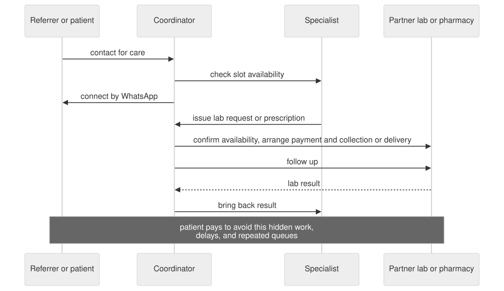

## Target User & Narrowest Wedge

**First customer:** a working adult in pain or under time pressure who needs
a verified gynecology or GP consultation and cannot lose a workday to
hospital queues.

**First offer:** browse verified providers or open a specialist's own shared
profile link with no account, then sign up directly, book a verified
specialist with a real Nomba payment, receive a laboratory request, book a
verified laboratory with a real Nomba payment, and return the real result to
the patient and requesting specialist without losing consultation context.


The lab-result loop remains the safety spine because the requesting
specialist receives the result in the same Care Journey. The launch scope
also includes the consultation's Care Plan and prescription-based pharmacy
fulfillment, without real-time inventory, substitutions, controlled-drug
workflows, or fleet dispatch.

## Constraints

- Patients are the payer; specialists, laboratories, and pharmacies are
  supply-side partners settling into their own Nomba sub-account under
  Monovella's Nomba merchant account.
- Initially active specialties are gynecology and GP care. The product
  catalogue is designed to support urology, dietetics, physiotherapy,
  dermatology, and similar services after governed activation.
- Every provider must be off-platform verified before it becomes bookable or
  payable; an unverified provider's profile, if it exists at all, is not
  publicly discoverable.
- A specialist may offer and price only their approved specialties; each
  provider-specialty offering has its own fee, currency, and availability.
- The initial release must be simple: partner-entered availability, manual
  verification, basic status changes, and no real-time inventory or
  laboratory-system integration.
- Clinical records require explicit patient consent, role-based access,
  auditability, and a legal review for the Nigerian operating context before
  live use.

### Specialty activation foundation

The current market launch activates **General Practice** and **Gynecology**
only. A provider may have multiple approved offerings, such as GP at ₦4,000
and Gynecology at ₦10,000, but every appointment binds to exactly one offering
and snapshots that offering's fee/currency. One clinician has one live-care
capacity across all their offerings: overlapping holds, bookings, and live
consultations are not permitted.

An approved credential alone does not activate a service. A new specialty
requires a verified provider offering, an active reviewed routing policy, and
an operations/governance activation decision. The shared capability evaluator
must enforce those conditions at discovery, availability publication, hold,
booking, attendance, and care-plan referral hand-off. A missing, expired, or
unreviewed routing policy fails safely to support or GP recovery; it never
guesses a clinical destination.

Routine `paused` status stops new discovery and booking while preserving
confirmed appointments. A `safety_stopped` or credential stop blocks
attendance, preserves records, and raises an operations Alert rather than
silently cancelling or reassigning care. Reopening a safety stop requires a
fresh reviewer decision, valid credentials, active routing policy, named
operations owner, and a new audit event.

## Premises

1. Patients will pay to avoid the time and uncertainty of manually
   coordinating specialist care and the immediate next action.
2. A single Care Journey record, rather than a standalone marketplace
   transaction, is Monovella's differentiator.
3. Public discovery converts a provider's own patients into Monovella users:
   a specialist who shares their profile link brings paying patients, which
   is a distribution lever, not a feature for its own sake.
4. A functional vertical slice across all actors can be kept small by
   limiting specialties, partner count, and automation.
5. Provider supply interest must be converted into observed workflow use
   before it is treated as demand.

## Approaches Considered

### A: Lab-first concierge spine with public discovery

Selected for market launch. Deliver the consultation-to-next-action path,
including public browsing and shareable profiles and the selected pharmacy's
bounded fulfillment workflow, while keeping commerce and inventory automation
thin.

### B: Functional connected-care vertical slice

Post-launch hardening. Build the broader connected-care target only after
the lab-result loop, safety controls, and launch gates are complete.

### C: Care-journey command center

Center the shared timeline and Alerts queue while keeping marketplace
commerce deliberately thin. Defer role hubs and a general operations
dashboard to post-launch work.

## Recommended Approach

Build a web-based connected-care vertical slice with one canonical **Care
Journey** per consultation. It is the parent record for the patient,
specialist, notes, issued prescription(s), lab request(s), pharmacy
order(s), lab booking(s), payment(s), attachments, notifications, and status
timeline.

For market launch, use this model from public discovery through the Care
Plan's next actions. Real Nomba Checkout payments are verified transactions
in the journey, not a fixture. Pharmacy orders, critical-result safe-delivery
notifications, and Alerts with automatic recovery are enabled; a
general-purpose operations dashboard beyond the Alerts queue remains
disabled.

## Synthetic MVP Experience Contract

### Information architecture

The MVP uses one simple path, with a visible orientation point at every stage:

```text
Public provider browsing or shared profile link (no account)
  → Patient sign-up
  → Specialist discovery and booking
  → In-app consultation: SOAP note and Care Plan
  → Laboratory booking
  → Care Journey: released result
```

| Screen | First thing the user sees | Primary action | Secondary information |
|---|---|---|---|
| Public provider directory or profile | Verified specialists, laboratories, and pharmacies, or one provider's own shared profile. | Browse, or continue to sign up to book. | No account required to browse; credential and payout details never appear. |
| Patient sign-up | Why an account and consent are needed. | Create the account and continue to identity/consent. | Plain-language field validation and a support route; there is no allowlist check. |
| Specialist discovery and booking | Only verified, active GP or gynecology offerings and their current availability. | Select a provider-specialty offering and available slot. | Specialty, fee/availability evidence, recommendation rationale, and the current Care Journey next action. |
| Laboratory booking | The specialist-issued request, permitted instructions, and eligible verified laboratory slots. | Select a laboratory and slot. | The original consultation context and a safe recovery path. |
| My care: Care Journey | The current next action, accountable owner, and a chronological timeline. | Take the single allowed next action, or open the permitted result when released. | Role-authorized consultation, verified payment status, booking, and result summaries. |

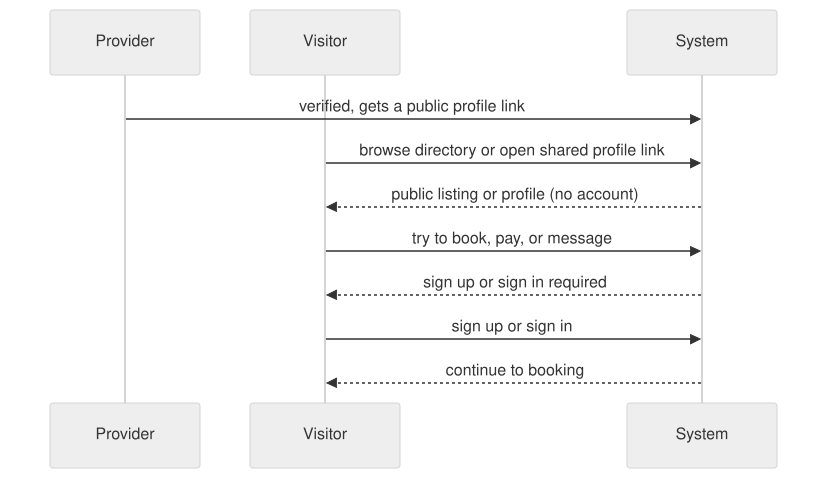

The specialist-issued request may be recorded through the minimal authorized
workflow needed to progress the journey. Do not create a standalone
specialist hub in this phase. The patient must never need to manually carry
the request or result between screens or providers.

### Interaction-state contract

| Surface | Loading | Empty or missing input | Recoverable failure | Success or partial state |
|---|---|---|---|---|
| Public directory/profile | Show a lightweight loading state for the listing or profile. | Explain when no verified provider matches the current filters. | Fall back to the full directory on a broken profile link. | Show only provider-submitted, admin-approved fields; the sign-up/sign-in prompt appears only on an attempt to book, pay, or message. |
| Patient sign-up | Show that account creation is in progress; keep submitted information visible. | Name the missing field beside its visible label; do not submit. | Explain an invalid, unavailable, or already registered email address in plain language; preserve safe non-sensitive input and offer sign-in or support where relevant. | Confirm entry and show the next admission action. |
| Specialist booking | Keep the selected journey context visible while options load. | Explain whether no verified active offering matches the currently activated launch specialties, then give the support/GP recovery route. | On stale-slot conflict, retain the selected offering and return the user to current availability. | Show the authoritative hold/next action and the verified real Nomba payment status. |
| Laboratory booking | Keep the requested test and consultation context visible. | Explain when no eligible laboratory slot is available and name the manual owner. | Preserve the request; do not create a booking without its linked journey and request. | Show the confirmed laboratory/slot and the patient-safe next action. |
| Care Journey and result | Keep the next-action card and prior milestones visible while authorized details refresh. | Explain that a result is not yet released, rather than presenting an empty record. | If file checks or access checks fail, show a recoverable status to the authorized actor and no result content or object key to others. | Show only permitted result metadata and the safe download/open action after release. |

### Trust and emotional arc

| Moment | Likely patient state | Interface support | One allowed action |
|---|---|---|---|
| Browsing or opening a shared profile | Curious or referred by a provider they already trust, unsure if signing up is worth it. | Show the provider's verified status and offering plainly; make the value of a Care Journey obvious before asking for an account. | Continue browsing, or start sign-up to book. |
| Sign-up arrival | Urgent and unsure whether the journey is legitimate. | Identify Monovella, explain why an account and consent are needed, and state what information is needed before showing a form. | Continue sign-up. |
| Consent and identity | Cautious about personal and health information. | Use visible labels, concise consent purpose/recipients, and a clear withdrawal/support route. | Give or withhold required consent. |
| Slot selection | Time-constrained and trying to avoid another queue. | Prioritize verified availability and make changed availability explicit. | Select a valid slot. |
| Waiting for the next handoff | Uncertain whether someone owns the work. | Keep the next-action card, owner, expected-by value where available, and timeline visible. | Refresh or contact the named manual owner. |
| Result release | Concerned about what a report means. | Use non-diagnostic language, identify the requesting specialist, and offer only the permitted result action. | Open or download the released result. |

### Responsive and accessibility contract

| Context | Required behaviour |
|---|---|
| 320px and above | Use one reading column; show the next action before secondary detail; turn tables into labeled rows; do not require horizontal scrolling for browsing, admission, booking, or result access. |
| Tablet | Preserve the same action order; use progressive disclosure for secondary journey details rather than a crowded tab strip. |
| Desktop | Keep navigation persistent and retain the current next action and timeline near the top of the workspace. |
| Keyboard and screen reader | Use semantic landmarks, visible focus, logical heading order, labeled fields, error summaries that move focus only when helpful, and controls operable without hover. |
| Status and motion | Pair status color with an icon, label, and explanation; meet WCAG 2.2 AA contrast; respect `prefers-reduced-motion`. |

This document does not define visual identity (typography, color, spacing).
That belongs to whatever design-system reference the team maintains at
implementation time; it must still satisfy the accessibility contract above.

## Launch Target Experience

### Patient path

- Browse verified specialists, laboratories, and pharmacies, or open a
  provider's own shared profile link, with no account.
- Create an account and receive an immutable, human-readable Monovella ID.
- Describe a concern in plain language or choose a reviewed non-diagnostic
  concern tag. A fixed, clinically reviewed safety intercept stops explicit
  safety-rule matches before the separate GP/gynecology mapper runs.
  Optionally choose a coarse city/LGA/district, then search verified
  specialists by name, specialty offering, available locality basis,
  availability, and disclosed offering fee; sort by nearest when locality is
  available, lowest fee, or earliest slot without implying a clinical rank.
- Book and pay for a consultation; see its status and every next action in the same journey.
- Receive a prescription or lab request from the consultation.
- Search pharmacies by medication, location, or name; submit a prescription
  order, then review the selected pharmacy's confirmed availability and final
  price, choose pickup/delivery, and pay.
- Search labs by requested test, location, or name; compare displayed test price and slots; book and pay; view results in the journey when uploaded.

### Specialist path

- Upload licence, certificates, and specialty-specific credentials for admin approval.
- Once verified, get a public profile page that can be shared with existing
  patients, showing only admin-approved fields; credential and payout
  details never appear there.
- Create availability, booking capacity, and prices only for verified,
  activated specialty offerings; availability remains shared across the
  clinician's offerings.
- View the patient and linked journey at consultation time; write text notes and attach images/documents.
- Issue structured prescriptions and lab requests linked to the consultation.
- Receive a notification and view a lab result only for a test the specialist requested.


### Laboratory path

- Upload organisational credentials; remain unavailable to patients until approved.
- Manage supported tests, displayed pricing, schedule, appointment slots, capacity, and availability.
- Process a booked lab request and upload the result against that request.
- Result upload notifies the patient and requesting specialist and is retained in the original journey.


### Pharmacy path

- Upload licence and credentials; remain unavailable until approved.
- Manage profile, opening hours, pickup/delivery support, and whether orders are accepted.
- Receive a prescription-linked order, confirm or reject medication availability, enter the price, and advance the order through preparation, pickup/delivery, and completion.

### Shared platform rules

- Platform admin verifies all provider and organisation credentials before
  service activation, and records the reviewed routing policy and operations
  activation needed for each specialty. As the operations owner, the admin
  also resolves any Alert the system can't recover automatically.
- Every clinical and fulfilment object has a durable link to patient, care journey, and originating consultation where applicable.
- Use explicit statuses for consultations, lab bookings, pharmacy orders, payments, and results; show the patient the next required action.
- The first release uses partner-entered data and manual operational follow-up. It does not claim live inventory, automatic insurance adjudication, delivery-fleet dispatch, clinical triage, or interoperability with hospital EHR/LIS systems.

### Regulatory verification baseline

- Verify medical specialists through the Medical and Dental Council of Nigeria (MDCN), laboratories and medical laboratory practitioners through the Medical Laboratory Science Council of Nigeria (MLSCN), and pharmacies and pharmacists through the Pharmacy Council of Nigeria (PCN).
- Treat the Nigeria Data Protection Act 2023 and Nigeria Data Protection Commission (NDPC) as the current data-protection framework for the launch. The National Health Act provides sector context but is not the provider-verification register.
- Operate real patient records, result uploads, and payments only under the
  documented consent, access, capacity, and evidence controls. Record
  professional review when completed; never claim sign-off early, and pause
  an affected capability when a reviewer condition or control failure makes
  continued operation unacceptable.


## Open Questions

- Which five to ten initial partners can satisfy those verification and service-level requirements?

Consent and access policy, admission fields, slot holds, payment recovery,
lab-request structure, initial service-level targets, result metadata,
attachment formats, public discovery scope, Nomba sub-account settlement, and
Alert/automatic-recovery behavior are settled launch decisions, documented in
[`PRODUCT_SPEC.md`](../product/PRODUCT_SPEC.md). The launch implements only
the `PRODUCT_SPEC.md` subset. Legal, clinical, and commercial review and each
selected partner's contractual acceptance remain operating-accountability
work rather than product-definition questions.

## Success Criteria

- Complete five scripted launch Care Journeys that collectively exercise all
  ten Must-Haves with verified GP/gynecology, laboratory, and pharmacy
  actors.
- At least one patient discovers a specialist through public browsing or a
  shared profile link before signing up.
- At least one patient uses the reviewed concern match and chooses a specialist
  using disclosed fee or proximity; the order is never presented as clinical
  ranking.
- Complete an in-app LiveKit consultation with a patient-shared note or attachment, rehearse the named fallback
  separately, and retain an original SOAP capture beside editable transcription.
- Every completed consultation has a completed note and either a sent Care Plan
  or a patient-visible no-further-action summary; at least one patient completes
  a Care Plan action.
- At least three journeys reach a completed laboratory test without the patient
  chasing a provider. Patient and requesting specialist can open their permitted
  result, and the critical-result acknowledgment/fallback path passes rehearsal.
- Complete one pharmacy order from availability/final-price confirmation through
  payment and fulfilment; separately prove a declined or expired submission
  cannot be charged.
- Rehearse one automatic-recovery case (a payment that lands after its hold
  expires) and confirm it either self-resolves through Nomba or raises a
  correctly routed Alert.
- Verify patient, specialist, laboratory, and pharmacy views and record zero
  unauthorized clinical reads in the acceptance run.
- Measure consultation-to-next-action completion, booking and pharmacy-response
  times, payment verification, notification delivery/acknowledgment, and manual
  interventions; capture one observed surprise from each actor type.

## Distribution Plan

Distribute the open sign-up link directly through trusted referrers and
WhatsApp, admit only verified specialist, laboratory, and pharmacy partners,
and let a verified provider's own shared profile link bring their existing
patients into Monovella. The sign-up link may be forwarded; a global
operating-capacity switch, not an identity allowlist, pauses new sign-ups or
journeys when capacity is full. Move each active journey into Monovella and
keep existing journeys accessible during a pause.

## Dependencies

- Pre-verified initial gynecology or GP specialists and a small laboratory
  partner network with manually entered availability.
- Real clinical records (dummy data is development-only), a working Nomba
  Checkout integration (live mode) with per-provider sub-accounts
  configured, a working critical-result acknowledgment workflow, and named
  operations owners for Alerts in each scripted journey.
- Operational consent, privacy, DPIA, records-access, credential, prescription,
  and lab-result controls, with DPO/legal/clinical review and recorded sign-off.
- Nomba account setup, each partner's configured Nomba sub-account, and
  legal/commercial confirmation of the settlement and refund model described
  in `PRODUCT_TECH.md`.

## The Assignment

Run five connected-care journeys with real patients and real results, using a
simple internal Care Journey checklist. For each, record the timestamp and
owner of every handoff, the verified Nomba payment status, every manual
intervention or Alert raised, whether the requesting clinician accessed the
permitted result view, and whether the patient completed the selected Care
Plan action. Do this before adding advanced search, inventory, or delivery
automation.

## Functional Requirements

This section is the detailed requirements reference for the target
connected-care vertical slice, as understood at the time of this revision
(2026-09-14). It does not replace `PRODUCT_SPEC.md`, which wins on any
conflict. Unless explicitly named in the Synthetic MVP Experience Contract,
requirements below belong to post-launch hardening and must not expand the
approved launch scope.

### Care continuity and identity


- The patient receives an immutable, human-readable Monovella ID for safe external reference. It never replaces the internal database identifier.
- Every consultation, case note, prescription, pharmacy order, lab request, lab booking, lab result, payment, notification, and attachment remains linked to the patient, Care Journey, and originating consultation where applicable.
- The platform supports five actor types: patient, medical specialist, laboratory, pharmacy, and platform admin.

### Patient requirements

- Browse verified specialists, laboratories, and pharmacies, or open a
  provider's own shared profile link, without an account. Sign-up is
  required only to book, pay, or message a provider.
- Create and manage an account, profile, Monovella ID, bookings, consultation history, prescriptions, lab requests/results, pharmacy orders, and relevant notifications.
- Describe a concern in plain language or choose a reviewed non-diagnostic
  concern tag. A versioned fixed-rule safety intercept runs before the separate
  non-diagnostic specialty mapping. The patient can optionally choose a coarse
  city/LGA/district and then find verified specialists by name, specialty,
  available locality proximity, availability, and consultation price. Profiles display
  verified specialties, relevant credentials, pricing, availability, profile
  information, verification status, and the non-diagnostic match reason.
- Select a specialist, view a valid slot, book and pay for a consultation, receive confirmation, and receive the prescription or lab request produced by the consultation.
- From a prescription, search pharmacies by prescribed medication, location, or name; view partner-stated opening hours, availability, medication availability, and pickup/delivery support; then submit, confirm, pay for, and track an order.
- From a lab request, search laboratories by requested test, location, or name; view supported tests, displayed pricing, appointment slots, opening hours, and verification status; then select a slot, pay, attend, and view the result in the original journey.

### Specialist requirements

- Specialists hold professional accounts and upload a licence, certificates, specialty credentials, and required verification documents. Every specialty is verified independently; only approved and activated offerings may be publicly bookable or priced.
- Once verified, a specialist's profile becomes publicly viewable and
  shareable, showing only fields they submitted and the admin approved for
  public display. Credential documents and payout details never appear
  publicly.
- A specialist configures working days, consultation hours, slots, capacity, blocked periods, and acceptance of new bookings for their offerings; provider-wide conflict protection prevents one clinician from overlapping care across specialties.
- During or after a consultation, the specialist can view authorized patient context, record text notes, attach images/documents, issue structured prescriptions, and request laboratory tests.
- A lab request retains the patient, requesting specialist, consultation, requested tests, authorized clinical notes, request date, and instructions. The requesting specialist can see permitted booking/completion progress and is notified when their requested result is uploaded.

### Laboratory requirements

- Laboratories hold organisation accounts and must upload licences, registration documents, certificates, and other required credentials before they can provide services.
- A laboratory manages supported tests, displayed pricing, instructions, operating hours, appointment slots, capacity, blocked dates, and whether a test or booking is available.
- Authorized laboratory staff receive bookings, view the minimum original request context, check in the patient, record sample collection, update processing progress, and upload the completed result against the original request.
- Result upload accepts PDF, PNG, and JPEG files only. It validates the actual content, size, checksum, and malware-scan state; links the result to the booking, lab request, consultation, patient, and journey; notifies the patient and requesting specialist; and makes the result available only to those authorized actors.

### Pharmacy requirements

- Pharmacies hold organisation accounts and must be verified before becoming actionable. They manage business identity, location, contact details, opening hours, pickup/delivery support, service area, and whether they accept orders.
- A pharmacy order is linked to the original prescription and consultation.
  Pharmacy staff respond within 15 minutes during operating hours by declining
  with a reason or confirming availability, offered fulfilment methods, and a
  final NGN price valid for 20 minutes. The patient selects pickup/delivery and
  pays only against that valid confirmation; after verification, staff prepare,
  mark ready for pickup or out for delivery, and fulfil the order.
- Real-time inventory, automatic substitutions, fleet dispatch, partial
  fulfillment, and controlled-drug workflows remain out of scope for this
  slice. A pharmacy may decline an order with a reason rather than silently
  substitute a medicine; the patient never sees an availability promise or
  final price until the pharmacy confirms it.

### Verification, administration, and access

- Credential records capture type, number where applicable, issuer, issue and expiry dates, documents, reviewer decision, rejection reason, resubmission, and expiry tracking.
- Verification states are `Pending`, `Under Review`, `Verified`, `Rejected`, `Expired`, and `Suspended`. Admins can manage users and partners, review credentials, approve/reject/suspend service access, review transactions and payment activity, monitor journeys, and manage disputes where required.
- Verification is a prerequisite for public discovery, pricing, slot creation, booking, and fulfilment.
- Clinical records require a versioned, Care Journey-scoped patient authorization that names the recipients, purpose, and data categories; least-privilege role access; auditability; and legal/clinical-operating review before live use. Patients may access their own released records; the requesting specialist and selected laboratory receive only their assigned clinical scope; operations receives non-clinical workflow metadata by default. Optional marketing, research, or analytics consent is separate.

### Status and payment requirements

- Consultation, laboratory booking, pharmacy order, payment, verification, and result records use explicit state transitions and expose the patient's next required action.
- Lab booking states: `Requested`, `Booked`, `Paid`, `Checked In`, `Sample Collected`, `Processing`, `Result Ready`, `Completed`, `Cancelled`.
- Pharmacy order states: `Submitted`, `Confirmed`, `Awaiting Payment`, `Paid`,
  `Preparing`, `Ready for Pickup`, `Out for Delivery`, `Fulfilled`, `Declined`,
  `Expired`, `Cancelled`.
- Payment records link to their underlying transaction and support `Pending`, `Successful`, `Failed`, `Expired`, `Reversed`, `Refunded`, and `Partially Refunded`. Each provider settles into its own Nomba sub-account under Monovella's Nomba merchant account (see `PRODUCT_TECH.md`); this is what lets Monovella trigger an automatic Nomba refund on a stuck payment without depending on the provider. Monovella does not run a wallet, balance, or commission ledger.

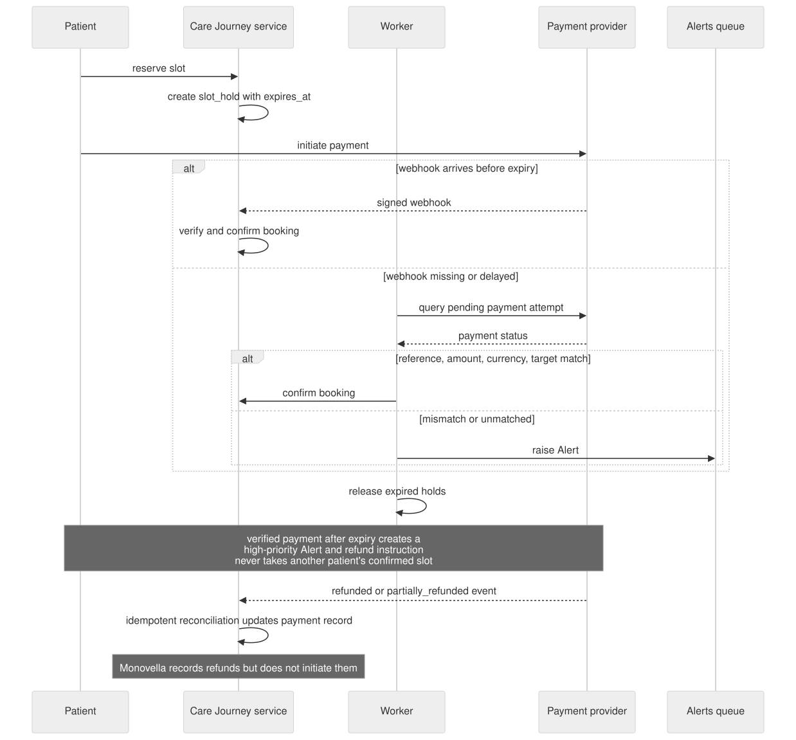

### Notifications and primary flows

- Patients are notified about consultation booking/reminders, prescriptions, lab requests/bookings/reminders/results, pharmacy availability/fulfilment, and delivery updates where activated.
- Specialists are notified about new or cancelled consultations and results they requested. Laboratories receive booking and cancellation notices. Pharmacies receive prescription requests and payment confirmation when activated.

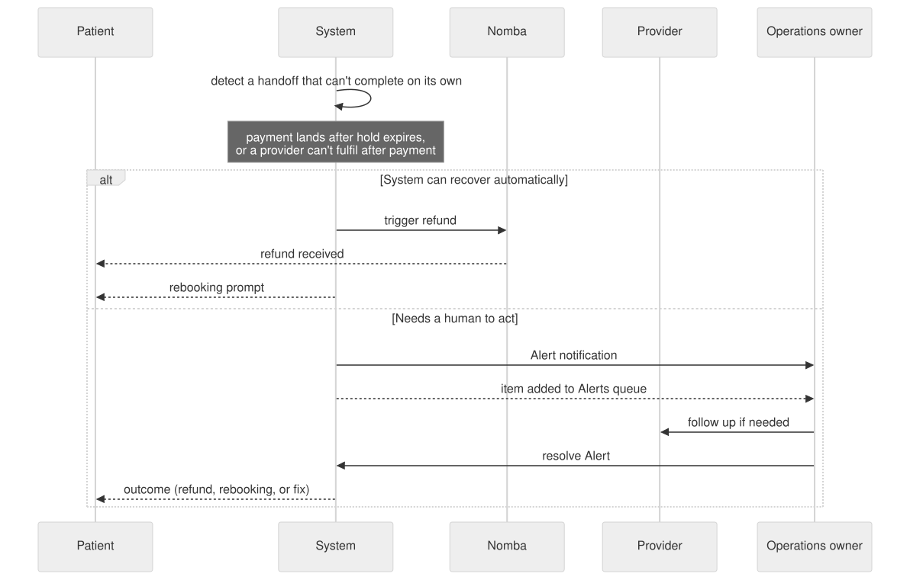

The patient must never have to manually move the request, result, or fulfilment context between participating providers.

## Approved Operating Decisions

Decisions 1-4 and 8, 10-12, 14, 16-18 below were made during the CEO review
on 2026-09-08 and hold unchanged. Decisions 5, 6, 7, 9, 13, and 15 were
updated in later founder sessions and now reflect `PRODUCT_SPEC.md` directly;
where this list and the spec differ, the spec wins.

1. **Product path:** Build a patient-owned Care Journey with a lab-result safety spine. It includes verified specialist booking, in-app consultation, Care Plan, payment evidence, specialist-issued lab requests, partner-lab booking, prescription-based pharmacy fulfillment, and result return.
2. **Real-data operation:** The directly shared link uses open sign-up and may be forwarded. Market-launch journeys use real patient records, result uploads, and payments under the operational consent, privacy, DPIA, clinical, and access controls. A server-side switch pauses new sign-ups or journeys for everyone when approved capacity is reached; this is not an identity allowlist.
3. **Partner reliability:** Admit partners only after they accept measurable targets for slot confirmation, lab booking confirmation, and result upload. An Alert is raised to the operations owner before any target is breached.
4. **Critical results:** Laboratories classify results as routine or critical under their own clinical policy. A critical upload creates an auditable, tiered acknowledgment workflow to the requesting specialist and designated partner contact; patient messaging is pre-approved and non-diagnostic.
5. **Payments:** Each specialist, laboratory, or pharmacy settles into its own Nomba sub-account under Monovella's Nomba merchant account. Nomba Checkout uses a configured split payment to allocate the partner's share to its sub-account. Monovella retains an immutable, server-verified payment record and releases a booking or paid pharmacy order only after verification. A pharmacy order is payable only after a valid availability/final-price confirmation. This sub-account structure is what lets Monovella trigger an automatic Nomba refund on its own, without depending on the provider; Monovella does not run a wallet, balance, or commission ledger.
6. **Alert ownership:** Each active journey has one named Monovella operations owner. Transfers are recorded, and a raised Alert cannot remain unresolved without a deadline.
7. **Notifications:** Persist critical notification events with recipient, channel, journey, trigger, delivery state, retry count, and correlation ID. Retry transient failures and raise unresolved critical notices to the operations owner as an Alert.
8. **Record privacy:** Store clinical files privately and authorize every access server-side or with short-lived, audience-bound links. Notifications contain no diagnosis, test name, result, or attachment.
9. **Release rehearsal:** Run the five scripted dummy-data journeys before the
   first production journey and after material releases. Cover cancellations, failed
   payment verification, delayed confirmations, duplicate events, pharmacy
   decline/expiry, critical-result follow-up, and notification failure/retry.
10. **Rollout:** Distribute the open sign-up link directly and admit only pre-verified providers. Enforce an approved active-journey ceiling with server-side sign-up/new-journey switches, while preserving existing records and access. Independently gate clinical data, booking, result upload, and notifications, with a five-minute rollback checklist that alerts the journey owner.
11. **State integrity:** Define actor-owned state machines for consultations, lab bookings, payments, results, and notifications. Reject invalid transitions, use idempotency keys for external events, and audit every transition.
12. **Authorization:** Use patient-owned, journey-scoped grants. Limit each specialist, laboratory, and operations actor to assigned objects; record consent version, scope, expiry/revocation, and clinical-access events.
13. **Operations visibility:** Ship an Alerts queue for overdue handoffs, notification failures, payment mismatches, and critical-result acknowledgements, with a short runbook for each Alert and its assigned owner.
14. **Admission and discovery data:** Require full legal name, date of birth, verified email address, adult-eligibility confirmation, and privacy/consent records. There is no allowlist, invitation, or referral admission check. Phone identity is deferred until the Termii sender ID is approved; it must attach to the same patient account only after independent verification. A patient may later supply a canonical city/LGA/district code for proximity ordering; never collect precise GPS or a home address for discovery, and clear the code within 90 days of selection or last activity. Collect an emergency contact, government ID, and clinically relevant demographics only when required by the workflow or partner.
15. **Capacity:** Hold consultation and laboratory slots for 20 minutes. Show the countdown, cancel the associated Nomba order and release capacity at expiry, and route a verified late payment to an automatic refund or a rebooking prompt, raising an Alert only if it can't self-resolve.
16. **Laboratory requests:** Use partner catalogue codes as the market-launch source of truth, with optional verified LOINC mappings. Each requested test retains its status, priority, minimum clinical indication/supporting context, specimen requirements, and patient instructions; confirmed requests change only through cancellation or a versioned amendment.
17. **Partner service levels:** Confirm capacity-backed bookings automatically; acknowledge manual consultation exceptions within 15 minutes during operating hours and manual laboratory bookings within two business hours. Use the laboratory's published test-specific turnaround time for routine results. Notify authorized recipients within five minutes after release; require critical-result acknowledgement within 15 minutes, begin fallback follow-up at 15 minutes, and raise an Alert to operations by 30 minutes.
18. **Result files and access:** Accept PDF, PNG, and JPEG result attachments. Patients and requesting specialists may view or download released files within their journey scope; specialists may also see supplied structured values, units, ranges, flags, and clinical notes. Laboratories see their own request and result history. Operations sees delivery, deadline, acknowledgement, version, and scan metadata but no clinical content or file by default.

## Initial Implementation Sequence

This sequence illustrates the market-launch foundation and its path to
post-launch hardening. The launch-required work follows the ten Must-Haves
and the screen order in the Synthetic MVP Experience Contract.


## Not in Scope at Market Launch

- Real-time stock, automatic substitutions, partial fulfillment,
  controlled-drug workflows, and delivery dispatch. Pharmacy sign-up,
  prescription-based ordering, payment, and fulfillment status are launch
  capabilities.
- A wallet, balance, or commission ledger Monovella manages by hand: real
  Nomba Checkout payment, per-provider sub-account settlement, webhook
  verification, and reconciliation ARE in scope for the launch.
- A general-purpose operations dashboard beyond the Alerts queue, general
  workspace Redis fan-out, and dedicated specialist, laboratory, pharmacy, or
  operations hubs: the Alerts queue and the minimal shared Care Journey view
  are sufficient at launch. (Critical-result acknowledgment, notification
  delivery, and Alerts/automatic recovery are launch-required, not deferred:
  see Must-Haves 5 and 10 in `PRODUCT_SPEC.md`.)
- Full in-app credential review and catalogue/pricing administration beyond
  the platform admin's manual approve/reject dashboard. Public discovery,
  partner sign-up, availability, and pharmacy order workspaces are in scope.
- Native mobile apps, hospital EHR/LIS integrations, insurance adjudication,
  and clinical triage.

## What I noticed about how you think

- You brought paid cases, not generic market claims: people paid for specialist access, prescription help, and lab-result return.
- You separated demand from supply clearly: "the patient is the one paying."
- You defended the full journey but accepted the discipline to make it "simple [and] functional."
- You repeatedly focused on the patient's lost working time, not just booking convenience.
- When specialists asked for a shareable profile, you read that as a
  distribution lever, not just a favor to providers, and brought public
  discovery back into scope on that evidence.

## CEO Review Artifacts

The following artifacts describe the market-launch scope and the additional
post-launch hardening. `PRODUCT_SPEC.md` governs current recovery behaviour
for real Nomba payments and real clinical results.

### System architecture


### Error and rescue registry

| Codepath | Failure | Required response | User impact |
|---|---|---|---|
| Booking confirmation | Partner timeout or stale slot | Keep `Pending`, retry or raise an Alert by SLA | Clear pending state and coordinator follow-up |
| Payment verification | Missing, duplicate, or invalid callback | Verify server-side, deduplicate, retain evidence | No booking until verified; retry guidance |
| Result upload | Unauthorized actor, duplicate, or failed file upload | Reject/audit, retain prior result, follow up if critical | Clear retry state; no silent replacement |
| Notification delivery | Provider failure or unacknowledged critical result | Persist, retry, then queue an Alert | Authenticated in-app state remains visible |
| Access request | Revoked/expired/unrelated grant | Deny, audit, show no clinical detail | Safe access-denied response |


### Test and rollout coverage


### Failure modes and observability

| Failure mode | Rescued | Covered in release rehearsal | Visible to |
|---|---|---|---|
| Stalled partner handoff | Yes, SLA Alert | Yes | Journey owner and patient |
| Failed payment verification | Yes, verified retry | Yes | Patient and journey owner |
| Critical result unacknowledged | Yes, tiered follow-up | Yes | Specialist, partner contact, owner |
| Unauthorized clinical access | Yes, deny and audit | Yes | Security/audit team |
| Notification delivery failure | Yes, retry and queue | Yes | Journey owner |


### Implementation Tasks

These tasks summarize the operating controls;
[`monovella-mvp-api-dev-plan.md`](../plans/monovella-mvp-api-dev-plan.md) and
[`monovella-mvp-web-dev-plan.md`](../plans/monovella-mvp-web-dev-plan.md) are
the authoritative, complete implementation backlog. A general-purpose
operations dashboard beyond the Alerts queue remains deferred.

- [ ] **T1 (P1, human: ~2 days / Codex: ~20 min):** Care journey. Implement verified-phone admission, scoped grants, versioned consent records, state machines, idempotency, and audit events.
- [ ] **T2 (P1, human: ~1 day / Codex: ~20 min):** Operations. Implement the outbox, retries, the Alerts queue, owner assignment, and critical-result follow-up. (Critical-result follow-up and retry delivery are launch-required; a general-purpose dashboard beyond the Alerts queue is post-launch.)
- [ ] **T3 (P1, human: ~1 day / Codex: ~20 min):** Launch safety. Create repeatable dummy-data rehearsal tests, global sign-up/new-journey capacity controls, a rollback runbook, and legal/clinical control-evidence checks.
- [ ] **T4 (P2, human: ~1 day / Codex: ~20 min):** Partner operations. Capture verification, response targets, payment evidence, and per-provider Nomba sub-account settlement.
- [ ] **T5 (P1, human: ~1 day / Codex: ~20 min):** Launch experience. Implement public provider browsing/profiles and the patient, specialist, laboratory, and pharmacy surfaces described in this document's Synthetic MVP Experience Contract.
  - Surfaced by: Information architecture review. The launch needs a screen-level navigation contract.
  - Verify: a keyboard-operable path from browsing through sign-up reaches admission; each primary action reaches only its documented next surface.
- [ ] **T6 (P1, human: ~1 day / Codex: ~20 min):** Recovery and accessibility. Implement the interaction-state, responsive, and accessibility contracts for browsing, admission, booking, and result access.
  - Surfaced by: Interaction-state and responsive review. Failure recovery must be visible, not only enforced server-side.
  - Verify: 320px, tablet, and desktop checks; visible keyboard focus; labeled validation errors; and no core-screen horizontal overflow.

### Review verdict

The product is strategically coherent as a care-journey navigator, not a
hospital operating system or a public provider marketplace. Public discovery
exists to bring a provider's own patients into Monovella, not to compete on
marketplace breadth. Market launch operates with real care under the
documented controls and capacity boundary. Professional review must not be
claimed until its sign-off records are complete; an unacceptable reviewer
condition or missing control evidence requires the affected capability to be
paused and remediated.

## GSTACK REVIEW REPORT

| Review | Trigger | Why | Runs | Status | Findings |
|--------|---------|-----|------|--------|----------|
| CEO Review | `/plan-ceo-review` | Scope & strategy | 2 | CLEAN (2026-09-08/12) | Held scope; 13 operating decisions accepted |
| Codex Review | `/codex review` | Independent 2nd opinion | 0 | SKIPPED | Nested pass skipped because this review runs inside Codex |
| Eng Review | `/plan-eng-review` | Architecture & tests | 3 | CLEAN (2026-09-08/12) | Latest delta review: 5 issues accepted, 0 critical gaps |
| Design Review | `/plan-design-review` | UI/UX gaps | 2 | CLEAN (2026-09-08/12) | score: 6/10 → 10/10; reconciled MVP scope, screen hierarchy, states, trust, and responsive accessibility |
| DX Review | `/plan-devex-review` | Developer experience gaps | 0 | n/a | Not run |
| Product-doc realignment | direct edit | Sync content with `docs/product/*.md` after founder decisions | 1 | DONE (2026-09-14) | Ten Must-Haves, public discovery, Nomba sub-account settlement, and Alert/tiered-follow-up terminology folded in; no new CEO/Eng/Design review invoked since the underlying decisions were already settled in `PRODUCT_SPEC.md` |

**VERDICT:** The 2026-09-08/12 CEO, engineering, and design reviews cleared
the original scope for implementation. This revision brings the document's
content current with `PRODUCT_SPEC.md`'s later decisions; it does not
re-open scope that those reviews already cleared. Real clinical data remains
blocked by the separately tracked legal, clinical, consent, access-control,
and partner-service-level launch gates.

NO UNRESOLVED DECISIONS
