# Monovella MVP API Development Plan

Status: implementation-ready engineering plan
Scope: `api/` only. Web/frontend screens, routing, component states, and the
responsive/accessibility contract belong to
[`docs/plans/monovella-mvp-web-dev-plan.md`](monovella-mvp-web-dev-plan.md).

> This is a point-in-time gstack plan-review artifact, not a living
> reference. For the current product vision and technology choices, read
> `docs/product/PRODUCT_SPEC.md` and `docs/product/PRODUCT_TECH.md`; for the
> current data model and flow diagrams, read `diagrams/`.

This plan is written fresh against `docs/product/PRODUCT_SPEC.md`'s ten
Must-Haves, as if the API were being built from scratch for a better outcome.
It does not read or assume anything about the current `api/` directory's
implementation, by explicit founder instruction. Where it draws on
engineering concerns identified by the prior
`monovella-foundation-engineering-plan.md` (data model shape, state machines,
failure modes), it re-derives and re-justifies each one against the current
spec rather than carrying old content forward unchanged. A lot of that
earlier plan predates decisions settled this session: public discovery, the
Nomba sub-account settlement model, the Alerts/automatic-recovery Must-Have,
and ten Must-Haves rather than nine.

*Scope precedence:* `docs/product/PRODUCT_SPEC.md` is the authoritative
market-launch definition. If this document conflicts with it, the spec wins.
`docs/product/PRODUCT_TECH.md`, `PRODUCT_CONSENT.md`, `PRODUCT_PRIVACY.md`,
and `PRODUCT_DPIA.md` are the next layer down; this plan implements their
technology and control decisions, it does not re-decide them.
`docs/designs/monovella-mvp.md` sits at that same layer for Care Journey
vocabulary, state machines, and the experience contract; where this plan
conflicts with it, the design doc wins.

## Outcome

Ship a FastAPI modular monolith that is the single source of truth for
every clinical, capacity, and payment decision in Monovella's Care Journey.
By the end of this plan's task list, the API alone (with no web client
attached) can, through its own contract tests:

- admit a patient with layered consent (Must-Have 1);
- publish only verified, active GP/gynecology offerings, hold a slot, take a
  real Nomba Checkout payment, and confirm a consultation only on
  server-verified payment (Must-Have 2);
- carry a lab request from consultation to a paid, linked laboratory booking
  (Must-Have 3);
- release a real result only after content/checksum/malware checks pass, and
  serve a permission-scoped Care Journey read model to patient and requesting
  specialist (Must-Have 4);
- run a tracked, tiered acknowledgment workflow on a lab-classified critical
  result (Must-Have 5);
- onboard specialist and laboratory organizations through pending-until-
  verified self-service accounts with their own availability (Must-Have 6);
- onboard pharmacy organizations and run confirm-before-payment fulfillment
  (Must-Have 7);
- issue scoped LiveKit tokens for an in-app call and accept exactly one
  patient-shared note or image while that call is live (Must-Have 8);
- attach one patient-visible Care Plan outcome to every completed
  consultation (Must-Have 9); and
- detect a payment, booking, or handoff that cannot complete on its own, and
  either recover it automatically through Nomba or raise it as an Alert with
  a named owner (Must-Have 10).

None of this authorizes live operation. CAC registration, NDPC compliance
registration, and clinical-governance sign-off remain the launch gates
`PRODUCT_SPEC.md` names; this plan builds the system those gates release.

## Architecture

Monovella is a modular monolith. No frontend route, Redis key, object-store
object, or payment callback is authoritative for clinical access, booking
capacity, payment status, or workflow state. PostgreSQL owns every decision
transaction; a domain module is the only writer of its own aggregates.

| Layer | Technology | API's responsibility |
|---|---|---|
| Application API | FastAPI | Owns every role's identity, sessions, and clinical/financial commands. The only process that talks to Postgres, RustFS, LiveKit, and Nomba directly. |
| System of record | PostgreSQL | Every state transition commits here, in the same transaction as its audit event and outbox event. |
| Cache | Redis | Rate limits and the public discovery cache only, per `PRODUCT_TECH.md`. Never clinical content, payment truth, slot capacity, or a download URL. A Redis outage degrades to slower discovery, not wrong answers, because Postgres is re-queried on every command. |
| Private files | RustFS | Reached only through a server-authorized S3 adapter. The app never stores or returns a public URL; every access is a short-lived, audience-bound signed URL issued after a permission check. |
| Consultation | LiveKit Cloud | The API issues room-and-participant-scoped tokens and verifies LiveKit's own signed webhooks; it never trusts a client-reported call state. |
| Payments | Nomba Checkout | The API creates the order with a configured split allocation, verifies Nomba's signed webhook plus a server-side transaction re-query, and is the only actor that can trigger a refund. |
| Notifications | ZeptoMail, Termii | The API's outbox worker sends allow-listed, content-minimized templates and retries delivery; it never lets a template carry diagnosis, result, prescription, or attachment content. |

Domain modules (identity, verification, journeys, laboratory, pharmacy,
payments, files, notifications, operations, audit) are organized as vertical
slices, each owning its own aggregates end to end (command handlers, reads,
migrations for its tables). A module never writes another module's tables
directly; cross-module effects go through a command call or the outbox, so
one module's bug cannot corrupt another module's authoritative state.

## API/Web boundary


The API guarantees, and the web app must never re-implement:

- every workflow state transition and its validity (a consultation cannot
  move to a state the API did not command);
- payment verification and Nomba split settlement (a client-reported
  "payment succeeded" is never trusted);
- consent, authorization, and journey-scoped access grants (a role never
  gets broad browsing rights; every clinical read re-checks assignment and
  consent);
- file safety (content/checksum/malware checks) and short-lived signed
  access to private results and attachments;
- the permission-scoped Care Journey read model (`JourneyWorkspaceView`):
  which tabs a viewer may see, with an explicit non-sensitive reason for a
  hidden one, never a raw 403/404 the client has to interpret;
- the Alerts queue and automatic-recovery decisions (refund vs. rebooking
  vs. raising an Alert);
- notification content and delivery/retry state.

The web app (see `monovella-mvp-web-dev-plan.md`) owns screens, routing,
component states, responsive/accessibility behavior, and rendering the
API's next-action copy and permitted tabs verbatim. It never derives
workflow state, access, or payment truth locally, and it never needs a
role-specific endpoint the API doesn't already scope correctly, because the
API's read models are already permission-projected before they leave the
server.

## What already exists

This plan builds on documents, not code, per the founder's instruction to
plan fresh:

- `docs/product/PRODUCT_SPEC.md`: the ten Must-Haves, scope, and risks that
  govern this plan.
- `docs/product/PRODUCT_TECH.md`: the stack table above and the Nomba
  sub-account settlement rationale.
- `docs/product/PRODUCT_CONSENT.md`, `PRODUCT_PRIVACY.md`, `PRODUCT_DPIA.md`:
  the consent copy, data categories, retention schedule, and risk/control
  register the API's identity, consent, and access-control commands must
  satisfy.
- `docs/designs/monovella-mvp.md`: the Care Journey vocabulary, state
  machines, and experience contract this plan's API surface must serve
  (its web-facing detail is out of this plan's scope; see the boundary
  above).
- `diagrams/`: the data-model ER diagram, state machines, and flow diagrams
  referenced throughout this plan already reflect the current ten
  Must-Haves and are reused here by reference rather than redrawn.

## Data model and boundaries

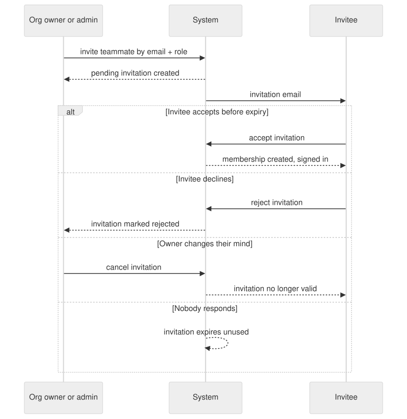

| Aggregate | Required fields / invariants | Owning module |
|---|---|---|
| `user`, `account`, `session`, `verification`, `patient_profile`, `service_locality` | Immutable human-readable Monovella ID, separate from the database ID; verified normalized email as the login identifier; `phone_number` stays null until an independently verified Termii flow attaches it to the same user; Argon2id-hashed credential; full legal name, date of birth, adult-eligibility confirmation; an optional canonical city/LGA/district code for proximity ordering, purged within 90 days of selection or last discovery activity per `PRODUCT_PRIVACY.md`. No government ID, home address, precise GPS, or emergency contact at sign-up. | identity |
| `organization`, `provider_membership`, `organization_invitation` | Organization type (specialist practice, laboratory, pharmacy), verification status, active/suspended state, payout eligibility; a clinical grant belongs to a named, active staff membership, never to the organization broadly. | identity + verification |
| `credential`, `specialty_offering` | Credential issuer, number, dates, reviewer decision, rejection reason, resubmission and expiry tracking; `specialty_offering` is the provider-specific bookable unit: specialty, fee/currency, activation state, availability, routing-policy version, reviewer and audit lineage. | verification |
| `care_journey` | Patient, current owner, lifecycle, current next action. Parent record for everything below. | journeys |
| `patient_concern` | Concern text or reviewed tag, safety-intercept ruleset/rule matched, optional discovery locality with its own purge deadline, matched specialty only for input the intercept clears. | matching |
| `consent_grant` | Versioned notice text, patient, named recipients, purpose, data categories, journey scope, granted/revoked/expiry timestamps; service consent and health-information consent are separate grants per `PRODUCT_CONSENT.md`. | identity |
| `consultation`, `availability_slot`, `slot_hold` | Bound to exactly one verified `specialty_offering`; fee/currency snapshot at hold time; a clinician's live-care capacity is serialized across every offering they hold, so a GP slot and a gynecology slot for the same clinician can never both be held at once; `slot_hold.expires_at` is 20 minutes after creation and is the sole authority patients see as a countdown. | journeys |
| `consultation_note`, `note_attachment` | SOAP-structured sections, a retained original capture alongside any editable transcription, malware-scan state, completed timestamp. | journeys + files |
| `call_session`, `consultation_shared_item`, `livekit_webhook_event` | Journey-bound LiveKit room and participant state; replay-safe webhook event ID; a shared note or image is accepted only while its call session is live, and Redis is never in this path. | notifications + files |
| `care_plan`, `care_plan_item` | Exactly one patient-visible outcome per consultation: a non-empty action plan, or an explicit `sent_no_action` summary. | journeys |
| `lab_request`, `lab_booking` | Patient, requesting specialist, consent grant, originating consultation and journey, status, priority, partner catalogue test code (optional verified LOINC mapping), minimum clinical indication, specimen requirement, patient instructions; a confirmed lab/test/slot link is immutable and changes only through a versioned amendment. | laboratory |
| `lab_result`, `attachment` | Request, consultation, journey, status/version, severity (`routine`/`critical`, set only from the releasing laboratory's own clinical classification), performing laboratory, specimen/effective/issued times, opaque private object key, MIME type, byte size, checksum, uploader, malware-scan state. | laboratory + files |
| `prescription`, `pharmacy_order` | Documented non-authoritative prescription record; submitted order; 15-minute pharmacy response deadline; confirmed final NGN price and offered fulfilment methods valid for 20 minutes; paid/fulfilment state and decline reason. | pharmacy |
| `payment_attempt` | Target type/id, Nomba order/transaction reference, amount/currency, configured split allocation (provider sub-account share, platform share), verified terminal status including expiry/reversal, idempotency key. | payments |
| `capacity_control`, `capability_gate`, `idempotency_record` | Global sign-up/new-journey capacity switch, a per-capability server-side gate, and an operation/key/request-fingerprint store for exactly-once command handling. | identity + shared |
| `alert`, `critical_result_handoff` | `alert`: journey, category, severity, deadline, assigned operations owner, status, resolution, audit trail: this is Must-Have 10's queue. `critical_result_handoff`: result, contact attempt, fallback contact, deadline, retry count, `acknowledged_at`, `acknowledged_by`: this is Must-Have 5's tracked workflow. | operations |
| `audit_event`, `outbox_event` | Actor, action, object, request/correlation ID, old/new state or reason, timestamp. The application database role has `INSERT` and read access only, never `UPDATE`/`DELETE`, enforced at the database level, not just by convention. | shared, append-only |

Every clinical read runs through a server-enforced, journey-scoped grant: the
patient owns the journey; the assigned specialist gets the
consultation/request scope; the selected laboratory gets only its own
booking/request scope; the selected pharmacy gets only the prescription and
minimum fulfilment data; operations gets non-clinical workflow metadata by
default. Every grant check and every clinical read or write records grant
reason, consent version, and an audit event, per `PRODUCT_DPIA.md` section 5's
required control evidence.

### Specialty activation and provider capacity

`specialty_offering` is the one source of truth for what a provider can be
booked and paid for. It holds the provider membership, specialty, per-
offering fee/currency, activation/availability state, reviewed routing-policy
reference, reviewer decision, and audit lineage. GP and gynecology are the
only initially active specialties; every other catalogue specialty stays
inactive until its own governed activation (verified provider offering,
active reviewed routing policy, and an operations/governance activation
decision, all three).

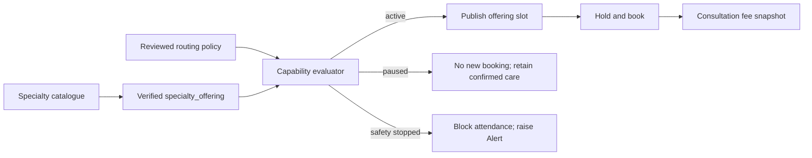

The capability evaluator is a server-owned function called at discovery,
slot publication, hold, booking, attendance, and care-plan referral
hand-off. A missing, expired, or unreviewed routing policy fails safely to
support or GP recovery; it never guesses a clinical destination. A routine
`paused` offering stops new discovery and booking while preserving confirmed
appointments. A `safety_stopped` or credential stop blocks attendance,
preserves records, and raises an Alert; reopening requires a fresh reviewer
decision, valid credentials, an active routing policy, a named operations
owner, and a new audit event.

Every `availability_slot` and `consultation` binds to exactly one offering.
The database command path serializes one clinician's live-care capacity
across every offering they hold: overlapping holds, bookings, and live
consultations across specialties are rejected at the command layer, not
merely discouraged in the UI.

## Workflow state machines

Only named command handlers change state. Each command validates the actor
and the predecessor state, takes a row lock or optimistic version, accepts
an idempotency key, and writes its audit event and outbox event in the same
transaction as the state change. An invalid transition is rejected before any
side effect runs.


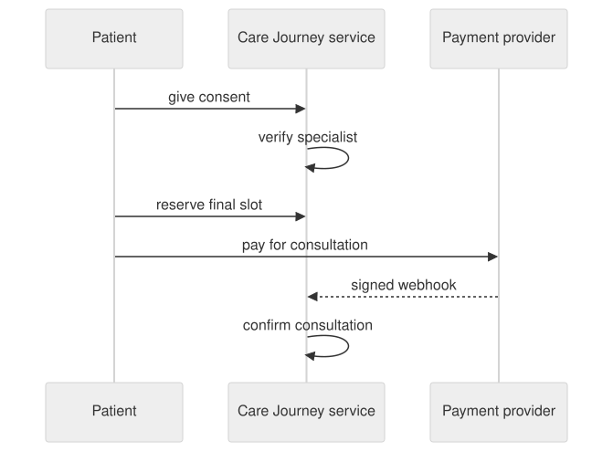
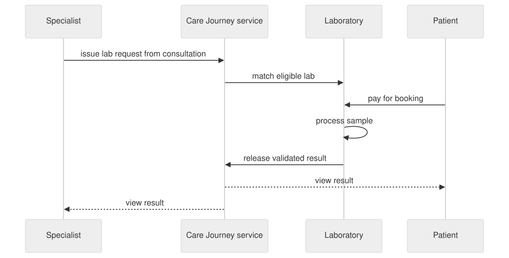

Lab booking states: `Requested`, `Booked`, `Paid`, `Checked In`, `Sample
Collected`, `Processing`, `Result Ready`, `Completed`, `Cancelled`.

Pharmacy order states: `Submitted`, `Confirmed`, `Awaiting Payment`, `Paid`,
`Preparing`, `Ready for Pickup`, `Out for Delivery`, `Fulfilled`, `Declined`,
`Expired`, `Cancelled`. A pharmacy order is payable only against a still-valid
availability/final-price confirmation; the state machine rejects payment
against an expired or already-consumed confirmation rather than trusting the
client to have checked.

Payment states: `Pending`, `Successful`, `Failed`, `Expired`, `Reversed`,
`Refunded`, `Partially Refunded`. A booking or paid pharmacy order transitions
only after server-side payment verification, never from a browser return URL.

For every payment-bearing command: verify Nomba's signed webhook and the
transaction server-side, deduplicate by Nomba event/reference, then run the
payment command inside its own transaction. A scheduled reconciliation job
covers a delayed or missing webhook by re-querying pending attempts past a
configured threshold, confirming only when reference, amount, currency,
target, and the configured split allocation all match the stored attempt.

## Nomba split-payment settlement

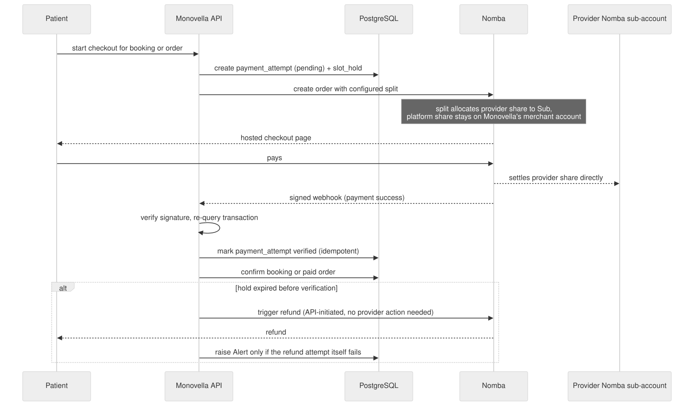

`PRODUCT_TECH.md` is explicit: each specialist, laboratory, or pharmacy
settles into its own Nomba sub-account under Monovella's Nomba merchant
account, and Nomba Checkout uses a configured split to allocate the
provider's share directly to that sub-account. This is not a Monovella-run
wallet or commission ledger; Monovella never holds provider funds and never
manually settles a partner. The reason this specific structure matters to
the API layer is narrower and load-bearing: **it is what lets the API
trigger an automatic refund on its own**, without depending on the provider
to act, which is the mechanism Must-Have 10's automatic-recovery path relies
on for a payment that lands after its slot hold expires.

Required API-side behavior:

1. Every checkout order is created with the provider's configured Nomba
   sub-account destination and share resolved from the offering (or pharmacy
   order) being paid for, never hardcoded or inferred from the request body.
2. A `payment_attempt` row is created before the Nomba order, linked to its
   `slot_hold` (consultation/lab booking) or its pharmacy-order confirmation,
   and carries an idempotency key so a retried checkout attempt cannot create
   a duplicate order.
3. Webhook handling verifies Nomba's signature, re-queries the transaction
   server-side rather than trusting the webhook body alone, and is
   idempotent against replay (same Nomba event ID processed twice is a
   no-op, not a double-confirm).
4. A verified payment that arrives after its `slot_hold` has expired never
   silently takes another patient's confirmed slot. The API either
   Nomba-refunds it automatically or offers a rebooking prompt, and raises
   an Alert only when neither can complete on its own (Must-Have 10).
5. Nomba-issued `refunded`/`partially_refunded` events update the payment
   record through an idempotent reconciliation command. The API records
   refunds; it does not claim to have manually processed money it never
   held.

## Result safety

A laboratory creates a private result draft, validates it under its own
process, and an authorized laboratory user releases it. Release notifies the
patient and the requesting specialist. Monovella never interprets a result
or triages it; the laboratory's own classification (routine/critical) is
accepted as given, not derived.

Release preconditions, all of which must pass before a result becomes
visible to anyone:

- actual content validation against the `application/pdf`, `image/png`,
  `image/jpeg` allow-list (never trusting the client's declared MIME type or
  file extension);
- checksum recorded against the stored bytes;
- a completed, clean malware scan (a scanner outage fails closed to
  "pending," never to "clean");
- the releasing actor is an authorized member of the assigned laboratory for
  that specific request.

A failed check leaves the result unreleased with a recoverable error to the
laboratory actor; it never partially releases or silently swaps in a
different file.

Released-result access is role-scoped: the patient may view and download
their own released file; the requesting specialist may additionally see any
supplied structured values, units, reference ranges, flags, and clinical
notes; the laboratory may access its own request, draft, release, and
correction history; operations sees delivery, deadline, acknowledgment,
version, and scan metadata but no clinical content or file by default. Every
one of these reads is server-composed, not a frontend filter over a bigger
payload, and every clinical read writes an audit event.

## Critical-result acknowledgment (Must-Have 5)

A `critical` release creates a `critical_result_handoff` immediately and
notifies the requesting specialist. The clocks below are `PRODUCT_TECH.md`
and `docs/designs/monovella-mvp.md`'s Approved Operating Decision 17 launch
defaults; the API stores them as configuration, not code, so an accepted
partner-specific value can override them without a redeploy:

| Step | Deadline from release |
|---|---|
| Released-result notification to authorized recipients | 5 minutes |
| Requesting specialist acknowledgment | 15 minutes |
| Fallback contact attempt begins | 15 minutes |
| Operations follow-up (Alert raised) | 30 minutes |

A worker re-evaluates open handoffs on a fixed schedule and drives these
deadlines off `deadline_at`, set once at creation. Acknowledging is the only
action that stops the tiered workflow; it confirms receipt, not diagnosis or
clinical action. If the requesting specialist is unavailable at release or
misses the deadline, the API preserves patient access, raises an Alert, and
uses the partner-approved fallback SOP; it never auto-shares the result with
a different, unassigned clinician.

## Alerts and automatic recovery (Must-Have 10)

`PRODUCT_SPEC.md` names three trigger shapes explicitly: a payment that lands
after its hold expires, a provider that cannot fulfil after payment, and any
other handoff that cannot complete on its own. For each, the API's job is to
try automatic recovery first and raise an Alert only when it cannot:

1. **Expired-hold late payment.** A worker releases expired `slot_hold` rows
   on a fixed schedule. A payment verified after its hold expired never
   reclaims the slot; the API triggers a Nomba refund or offers a rebooking
   prompt (patient's choice where both are viable), and raises an Alert only
   if the refund attempt itself fails.
2. **Provider cannot fulfil after payment.** A pharmacy decline after
   payment, or a laboratory/specialist that cannot honor a paid booking,
   raises an Alert immediately (this failure mode has no safe fully-automatic
   resolution, since it needs a human judgment call about the replacement
   path) while the payment record and evidence stay intact for the manual
   recovery. This is the pharmacy-side gap `PRODUCT_SPEC.md`'s Risks section
   names by name: "a partner has no verified payout account" and "a
   specialist runs multiple offerings, or one gets paused" both route here
   too when they interrupt an already-paid journey.
3. **Reconciliation mismatch.** A scheduled reconciliation job that finds a
   Nomba reference, amount, currency, target, or split allocation that does
   not match its stored `payment_attempt` raises an Alert rather than
   guessing which side is right.

An `alert` row always carries a category, severity, deadline, and a named
operations owner; a raised Alert cannot remain unresolved without a
deadline, per Approved Operating Decision 6. Alert resolution is itself an
audited command (owner, resolution, timestamp), not a status field anyone
can flip.

A general-purpose operations dashboard beyond this Alerts queue is
explicitly out of `PRODUCT_SPEC.md`'s scope (see NOT in scope, below) and
out of this plan.

## Auth, consent, and authorization

- **Admission.** `signup_patient_with_email` is the only command that admits
  a patient: open, direct self-service, no allowlist or invitation gate,
  matching Must-Have 1 and Approved Operating Decision 14. FastAPI issues a
  hashed, expiring one-time code for the normalized email; a single command
  atomically consumes it while creating the credential account, patient
  profile, and both required consent grants (service and health information,
  per `PRODUCT_CONSENT.md`). A failed admission attempt creates no partial
  account, profile, or consent row. `phone_number` stays null until an
  independently verified Termii flow attaches it to the same user ID.
- **Sessions.** FastAPI issues and validates hashed session tokens for every
  later clinical command; a password reset revokes existing sessions.
- **Consent.** `consent_grant` is versioned per notice text, named
  recipients, purpose, data categories, and journey scope. A clinical read or
  write re-checks the live grant at call time, not at login time, so a
  revoked consent takes effect on the very next request.
- **Provider access lifecycle.** A provider or organization suspension,
  credential expiry, or staff-membership removal revokes affected grants
  immediately (re-checked live, the same mechanism as patient consent, not a
  separate cache-invalidation problem). Active work becomes an Alert; any
  continuity access after a lapse is a fresh, time-limited, purpose-specific
  grant, never an automatic carry-over.
- **Denial shape.** An unrelated actor gets a 404, never a 403 that confirms
  the record exists; a revoked or expired grant gets the same non-revealing
  denial. Every denial is audited.

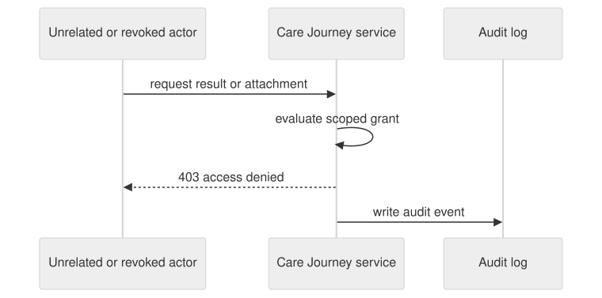

## Notifications

The outbox worker owns released-result and critical-result notification
delivery (Must-Have 5); it is launch-required, not deferred. Every payload is
an opaque target plus an allow-listed event type rendered from a fixed
template; templates never carry diagnosis, test name, result, prescription,
or attachment content, and always direct the recipient back to the
authenticated in-app view. A delivery attempt is retried independently of
the state transition that triggered it, so a retry cannot create a second
result, payment, or timeline entry. An unresolved critical-notification
failure raises an Alert to the operations owner rather than failing silently.

Patients are notified about consultation booking/reminders, prescriptions,
lab requests/bookings/reminders/results, and pharmacy availability/
fulfillment. Specialists are notified about new/cancelled consultations and
results they requested. Laboratories receive booking/cancellation notices.
Pharmacies receive prescription requests and payment confirmation.

## Files, cache, and storage

- RustFS buckets are private; the app never stores or returns a public URL.
  Upload and download go through server-authorized, short-lived S3
  operations issued only after a permission check.
- Redis is scoped to rate limits and the public discovery cache, per
  `PRODUCT_TECH.md`. It never holds a clinical-access grant, clinical
  content, payment truth, slot capacity, a transition authorization, or a
  download URL. A cache-miss or Redis outage falls back to a Postgres query,
  never to a stale or fabricated answer; discovery gets slower, never wrong.
- The Care Journey read model (`JourneyWorkspaceView`) is a server-owned
  query boundary, not a frontend composition of separate resource endpoints.
  It evaluates the current actor, active membership, consent, and
  journey-scoped grant on every call, returns only permitted tab metadata,
  summaries, next action, and timeline entries, and supplies a non-sensitive
  reason when a tab is unavailable. It carries a version (returned as an
  ETag) derived from what that specific viewer was shown, so two viewers of
  one journey never share a version and a change a viewer cannot see never
  invalidates their copy. This is the API contract the web plan's workspace
  screen renders; the API guarantees its correctness independent of any
  client.

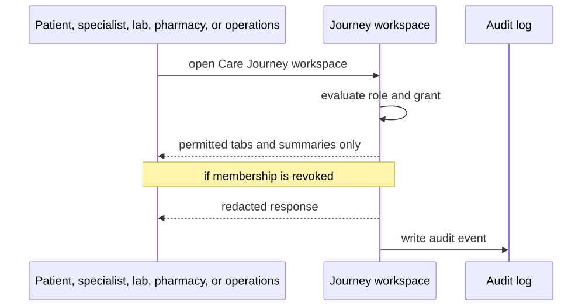

## Tests


Every command needs happy-path, invalid-predecessor, unauthorized-actor,
retry/idempotency, concurrency, and user-visible-error coverage. Payment and
file-storage adapter tests run against a real sandbox or an equivalent
contract double before either capability is relied on; a mocked-away
external dependency is not sufficient evidence for a launch-required
control.

| Check | Command / closure condition |
|---|---|
| Test database | A PostgreSQL-compatible test database is up before any integration test runs. |
| API integration | Command, state-machine, and concurrency tests pass against the real test database. |
| API static checks | Lint and type-check pass (see `.agents/skills/pydantic-settings`, `sqlmodel`, `alembic`, `fastapi`, `pytest` skills for this repo's specific conventions). |
| Payment adapter | Nomba split-payment, signature verification, idempotent webhook, and reconciliation contract tests pass against a sandbox or double. |
| Storage adapter | RustFS S3-contract tests cover upload, checksum, malware-scan-clean and malware-scan-failed paths, and denied-download. |
| LiveKit adapter | Token scoping and webhook signature-verification tests cover a valid call, a forged webhook, and a webhook replay. |
| Notification worker | Template allow-list, PHI-exclusion, retry, and Alert-on-unresolved-failure tests pass. |
| Migrations | Every model change ships with a reviewed Alembic migration; `alembic` skill conventions in this repo apply. |
| API reference | The OpenAPI schema stays in sync with the served routes; a stale reference is a CI failure, not a doc-debt item. |

Concurrency and locking tests deserve particular weight because they are
where a plausible-looking implementation silently fails under real load:

- two patients racing the final slot on one offering resolve to exactly one
  confirmed hold;
- one clinician cannot be held or booked across two specialties at the same
  time, even under concurrent requests;
- a duplicate Nomba webhook delivery is a no-op, not a double-confirm or a
  double-notification;
- a hold-expiry worker run concurrently with an explicit cancel never
  double-releases the same slot.

## Failure modes


| Failure | Control | Test | What the actor sees |
|---|---|---|---|
| Two patients reserve the final slot | Row lock / versioned reservation on `slot_hold` | Concurrent integration test | One sees a confirmed hold; the other sees current availability, not a crash |
| One clinician is held across two specialties at once | Provider-wide offering conflict check in the locked booking command | Concurrent cross-offering integration test | One hold/booking succeeds; the other sees current availability |
| Payment webhook forged or replayed | Signature verification, server-side re-query, idempotency key | Adapter + integration test | Booking stays pending or shows payment failed, never falsely confirmed |
| Payment verified after its slot hold expired | Automatic Nomba refund or rebooking prompt; Alert only if that fails | Late-payment integration test | Patient sees a clear refund/rebooking outcome, not a silently lost payment |
| Notification worker unavailable at release time | Transactional outbox with independent retry | Retry test | Result is released on time; notification is delivered later without duplication |
| Laboratory uploads the wrong or a corrupt file | Private draft, checksum, and release preconditions | File-failure test | Laboratory sees a recoverable error; patient sees no result until it is fixed |
| Consent is revoked mid-journey | Journey-scoped grant re-evaluated at every read/command | Access-denial integration test | Access denied without disclosing whether the underlying record exists |
| Redis is unavailable or evicts data | Postgres command revalidation; database-backed discovery fallback | Outage test | Discovery may be slower; every care and payment decision remains correct |
| RustFS is unavailable | No release commits before a durable object write succeeds | Storage-outage contract test | Upload/release fails visibly; there is never a false "result ready" state |
| Email address is already registered | Unique normalized-email constraint routes to sign-in | Duplicate-sign-up integration test | Plain-language "sign in instead," no second account created |
| A pharmacy declines after payment | Alert raised immediately; payment/evidence preserved | Decline-after-payment integration test | Patient sees a clear Alert-driven recovery path, never a silent charge with no fulfilment |
| Reconciliation finds a mismatched Nomba reference | Alert raised rather than auto-confirming a guess | Reconciliation-mismatch integration test | Booking stays unconfirmed until a human resolves the mismatch |

## NOT in scope

These exclusions apply to the current market-launch API. Anything
`PRODUCT_SPEC.md`'s own Scope section defers to post-launch is out of this
plan too:

- A wallet, balance, or commission ledger Monovella runs itself. Nomba's
  own split-payment settlement to provider sub-accounts is the entire
  settlement mechanism; the API never holds or manually moves provider
  funds.
- A self-serve provider credential application with automatic or no admin
  review. Reviewing and approving/rejecting credentials on the admin's own
  dashboard is in scope; an automated approval path is not.
- Treating a documented lab order or prescription as the legal instrument;
  the specialist's separately signed prescription or lab form remains that
  instrument.
- Native mobile apps, EHR/LIS/insurance integrations, clinical triage, or
  automated result interpretation.
- Dependant or guardian-managed accounts.
- A specialist-or-lab accept-or-decline step on a booking; a booking already
  confirms on verified payment.
- Real-time pharmacy inventory, automatic substitutions, partial
  fulfillment, controlled-drug workflows, and delivery-fleet dispatch.
- A general-purpose operations dashboard beyond the Alerts queue this plan
  builds for Must-Have 10.
- General Redis-backed live UI fan-out. The workspace read model's version/
  ETag is a refetch hint the web app polls or revalidates on; the API does
  not push clinical payloads through Redis.
- Any web-facing concern: screens, routing, component states, and the
  responsive/accessibility contract belong to
  `monovella-mvp-web-dev-plan.md`.

## Implementation task list

Every task below is scoped to `api/` and phrased so its own commit(s) would
read as Conventional Commits. None is marked complete; this plan assumes a
fresh build. Effort estimates follow this repo's convention of naming both a
human-team and an AI-assisted estimate.

- [ ] **A1 (P1, human: ~1 day / AI: ~20 min)** `feat(identity): open self-service patient admission with layered consent`: email-OTP admission, atomic account/profile/consent creation, session issuance, and duplicate-email routing to sign-in (Must-Have 1). Files: `api/identity/`, `api/audit/`.
  - Verify: concurrent-redemption-admits-at-most-one test; incorrect/expired/replayed/rate-limited code tests; underage or missing-consent rejection; duplicate-normalized-email test.
- [ ] **A2 (P1, human: ~1 day / AI: ~20 min)** `feat(identity): consent-grant model and server-side policy checks`: versioned `consent_grant`, live re-evaluation on every clinical read/write, revocation taking effect on the very next request. Files: `api/identity/`, `api/audit/`.
  - Verify: revoked-consent denial test; consent-version audit-trail test.
- [ ] **A3 (P1, human: ~1.5 days / AI: ~30 min)** `feat(verification): specialist and laboratory self-service accounts`: organization sign-up, credential upload, pending-until-verified state, admin approve/reject/suspend with a required reason, and specialty-offering management (fee/currency/availability per offering) (Must-Have 6). Files: `api/identity/`, `api/verification/`.
  - Verify: unverified-organization is undiscoverable/unbookable test; suspension revokes access on the next request test; per-offering fee/availability isolation test.
- [ ] **A4 (P1, human: ~2 days / AI: ~40 min)** `feat(journeys): specialty-offering capacity and provider-wide conflict protection`: `specialty_offering`, the capability evaluator (paused/safety-stopped/active), and one clinician's serialized capacity across offerings. Files: `api/journeys/`, `api/verification/`.
  - Verify: cross-offering concurrent-hold test; paused-offering-keeps-confirmed-care test; safety-stop-blocks-attendance-and-raises-Alert test.
- [ ] **A5 (P1, human: ~2 days / AI: ~35 min)** `feat(journeys): locked, idempotent consultation booking and slot holds`: `availability_slot`, `slot_hold` with a 20-minute authoritative expiry, and the concurrent-final-slot resolution (Must-Have 2). Files: `api/journeys/`.
  - Verify: concurrent-final-slot integration test; hold-expiry worker test; idempotent re-request test.
- [ ] **A6 (P1, human: ~1 day / AI: ~20 min)** `feat(payments): Nomba split checkout, signed-webhook verification, and reconciliation`: `payment_attempt`, per-provider sub-account split allocation, idempotent webhook handling, and a scheduled reconciliation job (Must-Have 2, feeds Must-Have 10). Files: `api/payments/`.
  - Verify: payment-adapter contract tests against a Nomba sandbox or double; duplicate-webhook test; reconciliation-mismatch test.
- [ ] **A7 (P1, human: ~1 day / AI: ~20 min)** `feat(journeys): automatic late-payment recovery and Alert creation`: hold-expiry worker, automatic Nomba refund or rebooking prompt, and Alert creation when neither can self-resolve (Must-Have 10). Files: `api/journeys/`, `api/operations/`, `api/payments/`.
  - Verify: late-payment-after-expiry test; refund-failure-raises-Alert test; explicit-cancel-vs-worker-expiry double-release test.
- [ ] **A8 (P1, human: ~2 days / AI: ~40 min)** `feat(journeys): consultation documentation and SOAP notes`: `consultation_note`/`note_attachment`, retained original capture alongside editable transcription, authorized-actor-only read/write. Files: `api/journeys/`, `api/files/`.
  - Verify: unauthorized-specialist-cannot-read-another's-note test; continuity-of-care read test for a later assigned specialist.
- [ ] **A9 (P1, human: ~2 days / AI: ~40 min)** `feat(notifications): in-app LiveKit consultation and live-call-only patient sharing`: server-issued, room-and-participant-scoped tokens, verified LiveKit webhooks, and `consultation_shared_item` accepted only while the call session is live (Must-Have 8). Files: `api/notifications/`, `api/files/`.
  - Verify: token-scoping test (a token cannot join another patient's room); forged-webhook-rejected test; share-after-call-ends-rejected test.
- [ ] **A10 (P1, human: ~1.5 days / AI: ~30 min)** `feat(journeys): Care Plan with mandatory patient-visible outcome`: `care_plan`/`care_plan_item`, enforcing exactly one outcome (action plan or `sent_no_action`) per completed consultation (Must-Have 9). Files: `api/journeys/`.
  - Verify: consultation-cannot-complete-without-an-outcome test; referral-hand-off test.
- [ ] **A11 (P1, human: ~2 days / AI: ~40 min)** `feat(laboratory): linked lab request, paid booking, and result release`: `lab_request`/`lab_booking`/`lab_result`, cross-organization slot-substitution protection, and the file-safety release preconditions (content/checksum/malware) (Must-Haves 3, 4). Files: `api/laboratory/`, `api/files/`.
  - Verify: cross-organization-slot-substitution-impossible test; release-blocked-without-clean-attachment test; role-scoped-download test.
- [ ] **A12 (P1, human: ~1 day / AI: ~20 min)** `feat(operations): critical-result acknowledgment workflow`: `critical_result_handoff`, the 5/15/15/30-minute clock, fallback contact, and the 30-minute operations Alert (Must-Have 5). Files: `api/operations/`, `api/laboratory/`, `api/notifications/`.
  - Verify: deadline/retry/fallback/follow-up timing tests; already-acknowledged-stops-the-workflow test.
- [ ] **A13 (P1, human: ~2 days / AI: ~40 min)** `feat(pharmacy): self-service accounts and confirm-before-payment fulfillment`: pharmacy verification, the full order state machine, the 15-minute response and 20-minute price-validity windows, and decline-with-reason (Must-Have 7). Files: `api/pharmacy/`, `api/verification/`.
  - Verify: payment-against-expired-confirmation-rejected test; decline-with-reason test; decline-after-payment raises an Alert (feeds A7's pattern).
- [ ] **A14 (P1, human: ~1.5 days / AI: ~30 min)** `feat(journeys): permission-scoped Care Journey read model`: `JourneyWorkspaceView` as a server-owned query boundary: permitted tabs, redaction reasons, next-action copy, and a per-viewer version/ETag (serves Must-Have 4, is the API/web boundary's central contract). Files: `api/journeys/`, `api/identity/`, `api/audit/`.
  - Verify: role-specific-projection test; revoked-membership-immediate-denial test; stale-ETag-revalidation test.
- [ ] **A15 (P1, human: ~1 day / AI: ~20 min)** `feat(files): private RustFS storage with content-safety checks`: S3 adapter, upload/download through server-authorized short-lived operations, content/checksum/malware validation shared by note attachments and lab results. Files: `api/files/`.
  - Verify: storage-contract tests against a real or doubled RustFS/malware-scan backend; storage-outage test (no false "ready" state).
- [ ] **A16 (P1, human: ~0.5 day / AI: ~10 min)** `feat(audit): append-only audit log and transactional outbox`: database-level `INSERT`-only enforcement on `audit_event`, and the outbox pattern every command writes through. Files: `api/audit/`, migrations.
  - Verify: application-role update/delete-denial test; command-atomicity test (state + audit + outbox commit or roll back together).
- [ ] **A17 (P2, human: ~1 day / AI: ~20 min)** `feat(operations): server-side capability gates and global capacity control`: per-capability gate plus the global sign-up/new-journey capacity switch from Approved Operating Decision 2, with a rollback path that preserves existing records and access. Files: `api/operations/`.
  - Verify: capacity-exhausted-blocks-new-signups-not-existing-access test; per-capability-gate-close-then-reopen test.
- [ ] **A18 (P2, human: ~0.5 day / AI: ~10 min)** `feat(payments): Redis-backed rate limiting and public discovery cache`: the only two allowed Redis uses per `PRODUCT_TECH.md`, both with TTLs, invalidation, and a fail-open-on-outage policy so a Redis blip never turns into a 500 on an auth or discovery request. Files: `api/identity/`, `api/journeys/` (discovery).
  - Verify: Redis-outage-fails-open test for rate limiting; cache-miss-falls-back-to-Postgres test for discovery.
- [ ] **A19 (P1, human: ~2 days / AI: ~45 min)** `test(api): quality gate across the full Must-Have surface`: real-Postgres integration tests, lint/type-check, payment/storage/LiveKit contract suites, and an OpenAPI-freshness check, all wired into CI. Files: `api/tests/`, CI configuration.
  - Verify: CI runs every suite above cleanly on a clean checkout.

### Sequencing

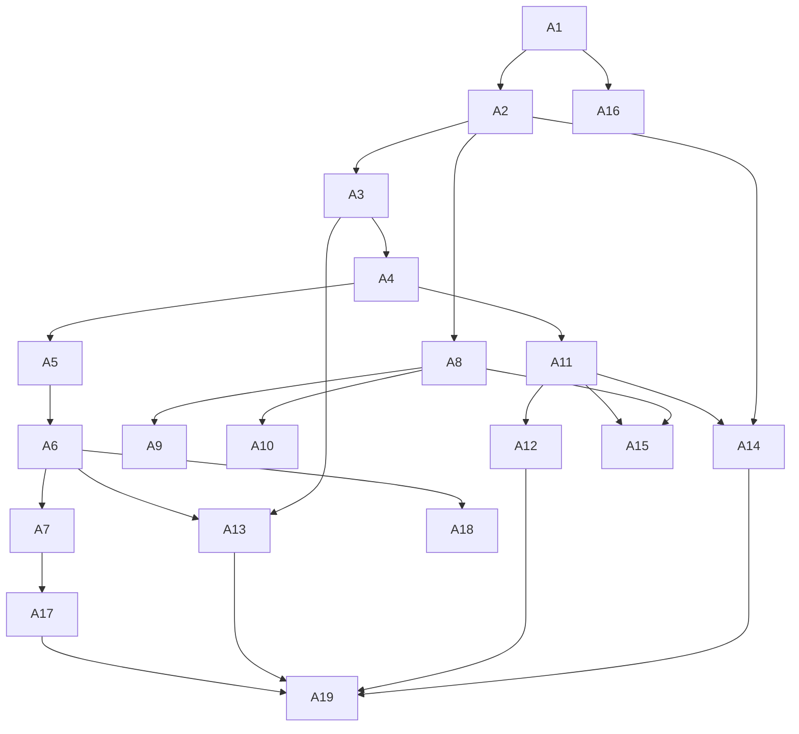

Identity and audit (A1, A2, A16) are the shared foundation everything else
depends on. Specialty-offering capacity (A3, A4) gates every bookable
surface, so it comes before booking (A5), payments (A6), and pharmacy (A13).
The read model (A14) and the quality gate (A19) close the plan: nothing is
launch-ready until every Must-Have's contract tests pass together, not
module by module.

## GSTACK REVIEW REPORT

| Review | Trigger | Why | Runs | Status | Findings |
|---|---|---|---|---|---|
| Fresh-plan re-derivation | direct authoring, per founder instruction | Rebuild the API plan from `PRODUCT_SPEC.md`'s ten Must-Haves rather than the superseded nine-Must-Have plan, without reading current `api/` code | 1 | DONE (2026-09-14) | Re-derived data model, state machines, Alerts/automatic-recovery (new Must-Have 10), and the Nomba sub-account settlement model directly from `PRODUCT_SPEC.md`, `PRODUCT_TECH.md`, `PRODUCT_CONSENT.md`, `PRODUCT_PRIVACY.md`, and `PRODUCT_DPIA.md`; consulted the old `monovella-foundation-engineering-plan.md` only for which engineering concerns to re-examine, not for its conclusions |
| `/plan-eng-review` (self-review, applied inline) | task instruction | Architecture soundness and completeness before this plan is treated as implementation-ready | 1 | DONE_WITH_CONCERNS (2026-09-14) | Applied the skill's four review lenses (architecture, completeness, tests, failure modes) as a self-review rather than the skill's full interactive `AskUserQuestion` loop: this is an unattended background session with no human present to answer decision briefs, and `gstack-question-log`/`gstack-decision-log` telemetry binaries are not meaningfully usable outside an interactive run. Findings folded into the plan directly rather than left open: (1) the old plan conflated API and web concerns throughout its Experience-Architecture section, this plan excludes it entirely and states the API/web boundary as its own section instead; (2) the old plan's task list was tied to actual code state ("DONE", specific file paths in an existing `api/` tree), which this plan cannot do without reading that code, so tasks here are written as fresh, unchecked work items against the ten Must-Haves; (3) the pharmacy-decline-after-payment and reconciliation-mismatch failure modes were under-specified in the old plan's Alerts section relative to `PRODUCT_SPEC.md`'s Must-Have 10 wording, both are now named explicitly in the Alerts and Failure-modes sections. Concern carried forward, not resolved here: this plan has not been checked against the sibling `monovella-mvp-web-dev-plan.md`, which was being drafted concurrently by another session and was deliberately not read to avoid depending on in-progress content; a follow-up cross-read once both plans are committed is recommended. |
| `codex review` / outside-voice cross-model check | plan-eng-review's outside-voice step | Independent second opinion on architecture and completeness | 0 | SKIPPED | No `codex` CLI available in this environment (`command -v codex` returned nothing) |
| `anthropic-skills:dev-team` `/plan` or `/research` | task instruction (optional, use if it adds value) | Sanity-check schema design, API contract shape, and failure-mode coverage | 0 | NOT RUN | This plan's schema, contract shape, and failure modes were derived directly from five detailed, already-reviewed product/design documents (`PRODUCT_SPEC.md` and its four companions, plus `docs/designs/monovella-mvp.md`), which already carry their own CEO/eng/design review history; a second general-purpose planning skill pass over the same ground was judged unlikely to surface anything the direct derivation and the `plan-eng-review` self-review above did not already catch, so it was not invoked |
| `/gstack diagram` | task instruction | New diagrams for API-implementation-angle content not already covered | 2 renders | DONE (2026-09-14) | Reused seven existing diagrams by reference (`system-architecture-stack`, `data-model-er-diagram`, `consultation-state-machine`, `lab-booking-state-machine`, `pharmacy-order-state-machine`, `result-state-machine`, `alerts-and-recovery-flow`, `capacity-payment-recovery-flow`) after confirming each already reflects the current ten-Must-Have model; created two new diagrams genuinely not covered elsewhere: `diagrams/api-plan-nomba-settlement-flow.mmd` (sequence diagram of the Nomba split-payment settlement to a provider sub-account, which no existing diagram shows at the sub-account-split level of detail) and `diagrams/api-plan-api-web-boundary.mmd` (a flowchart making the API/web responsibility split in this plan's own boundary section explicit as a diagram, not only prose). Both rendered through the full `.mmd` -> `.svg`/`.png`/`.excalidraw` pipeline via `gstack-render.ts`; `.claude/skills/gstack/lib/diagram-render/dist/*` build artifacts were checked after rendering and were not modified, so nothing there needed reverting. |
| Cross-read against `monovella-mvp-web-dev-plan.md` | follow-up docs audit | Confirm the API/web boundary drawn here matches what the sibling plan assumes the API provides, once both plans exist | 1 | DONE (2026-09-14) | Compared both plans' API/Web Boundary sections directly: state-machine ownership, journey-scoped authorization, server-driven capacity-hold countdowns, result-access scoping, and Alerts-queue ownership all match on both sides; the web plan's "version or `updated_at`" framing and this plan's `JourneyWorkspaceView` ETag are the same mechanism described at different altitudes, not a conflict; the web plan's polling/revalidation approach correctly assumes no Redis-pushed real-time payload, matching this plan's explicit exclusion of Redis-backed live UI fan-out. No boundary mismatch found. |

**VERDICT:** This plan is a complete, fresh re-derivation of the API-only
engineering surface against the current ten Must-Haves, with an explicit
API/web boundary so it does not duplicate the sibling web plan. The review
that ran was a solo self-review using `plan-eng-review`'s analytical lenses,
not its full interactive multi-turn process, because this session runs
unattended; treat any decision above marked as self-resolved as open to
override by a human engineering reviewer before this plan is treated as
final sign-off, as distinct from implementation-ready. Real API implementation
against this plan remains blocked on the same launch gates `PRODUCT_SPEC.md`
names: CAC registration, NDPC compliance registration, and clinical
governance sign-off.

NO UNRESOLVED DECISIONS
