# Monovella Web Development Plan

A fresh, frontend-only engineering plan for Monovella's web client. Written
from product and design truth, not from the existing `web/` implementation:
this plan does not read or reference current component code, routes, or app
structure under `web/src/` beyond `web/src/app.css` (checked only to confirm
live shadcn token names that `DESIGN.md` already documents) and `web/package.json`
(checked only to confirm currently installed dependencies and versions before
recommending new ones, per the reuse ladder).

Status: DRAFT, for engineering review before implementation.

## Scope Precedence

[`PRODUCT_SPEC.md`](../product/PRODUCT_SPEC.md) is the source of truth for
market-launch scope. [`PRODUCT_TECH.md`](../product/PRODUCT_TECH.md) is the
source of truth for the frontend technology stack (its Web experience row);
this plan implements that stack rather than re-deciding or restating it.
[`docs/designs/monovella-mvp.md`](../designs/monovella-mvp.md) is the source
of truth for screen-level experience requirements. `DESIGN.md` at the repo
root is the source of truth for the visual system: shadcn/ui theme tokens
and the two-typeface system. Where this plan conflicts with any of those
four, they win. This plan only elaborates them into a web implementation
approach; it introduces no new product scope.

Backend, data-model, workflow-state-machine, payment, and Nomba-integration
detail belongs to the sibling plan,
[`docs/plans/monovella-mvp-api-dev-plan.md`](monovella-mvp-api-dev-plan.md),
written in parallel on this same branch. This plan references it by expected
section name at the API/web boundary points below and does not duplicate its
content or read its in-progress draft.

## API/Web Boundary

The frontend renders authoritative server state. It never re-derives clinical,
financial, or workflow truth on the client. Concretely, drawn from
`PRODUCT_SPEC.md` and `docs/designs/monovella-mvp.md`'s Approved Operating
Decisions:

- **State machines (Decision 11).** Consultation, lab booking, pharmacy order,
  payment, and result states are server-owned enums. The client renders the
  current state and its server-supplied label, owner, and next action; it
  never computes a transition, guesses a status from partial data, or
  optimistically advances a state before the server confirms it.
- **Authorization (Decision 12).** Every Care Journey read is scoped by the
  server to the current actor's patient-owned, journey-scoped grant. The
  client requests a journey view and renders exactly the tabs and fields the
  server returns; a hidden or unavailable tab is explained by a
  server-supplied reason, never inferred client-side from a 403 or an absent
  field.
- **Capacity holds (Decision 15).** A 20-minute slot hold's countdown is
  computed from a server-supplied expiry timestamp, never from a client-side
  timer started on page load, to avoid clock-skew and background-tab drift.
  On expiry the client revalidates rather than assuming the hold is gone.
- **Result access (Decision 18).** The server decides who may view or
  download a result and what structured fields accompany it. The client
  renders only what a `GET` for that journey returns; it never keeps a client
  route or component that could render clinical content the current actor was
  not sent.
- **Alerts.** The Alerts queue, its owner assignment, and its runbook text are
  server-owned. The client lists what the server returns and submits a
  resolve action; it does not compute SLA breach locally beyond a
  display-only countdown driven by a server-supplied deadline, matching the
  capacity-hold pattern above.
- **What the frontend expects the API to guarantee:** a single per-Care-Journey
  read model that returns only permitted tabs, summaries, next-action, and
  timeline entries for the current actor (see the sibling plan's care-journey
  and authorization sections); a `version` or `updated_at` value on that read
  so the client can cheaply detect staleness without polling full payloads;
  idempotent write endpoints for booking, payment confirmation callbacks, and
  state transitions so a retried client request after a dropped connection
  never double-books or double-charges; and consistent problem-detail error
  shapes so the client can map a failure to one of the interaction-state
  contract's rows (see below) without parsing free-text messages.
- **What the frontend owns:** rendering every state the server can return
  (including pending, delayed, failed, blocked, and Alert-raised states)
  with the plain-language, non-diagnostic, patient-safe or role-appropriate
  copy the design doc's Trust and Emotional Arc and Interaction-State Contract
  require; keyboard and screen-reader operability; responsive layout down to
  320px; client-side field validation as a UX convenience only, never as the
  system of record for what the server ultimately validates again; and the
  LiveKit call UI, which owns real-time media state locally but treats the
  underlying consultation's clinical state (has it started, who documented
  it, is a Care Plan sent) as server-owned exactly like every other workflow
  state.

## Application Structure and Routing

The web client is a React Router application in framework mode (the repo
already pins `react-router` and `@react-router/dev` to v8, with SSR served
through `@react-router/serve`). This plan proposes a route tree organized by
actor area, each area behind its own layout route that resolves auth and role
in a loader, not in a client-side effect: an unauthenticated or wrong-role
visitor is redirected server-side by the loader before the route ever renders,
matching the API/web boundary above ("the client never decides its own
authorization").

Public routes carry no auth check. Every other area's layout loader calls the
API's session/whoami equivalent once, and every child route trusts that
result rather than re-checking auth itself.

| Path | Layout | Purpose |
|---|---|---|
| `/` | Public | Home: hero, value proposition, entry into the directory. |
| `/providers` | Public | Directory: specialists, laboratories, pharmacies, filterable. |
| `/providers/:providerId` | Public | One provider's shareable public profile. |
| `/sign-up` | Public | Patient self-service admission. |
| `/sign-in` | Public | Returning patient or provider sign-in. |
| `/app` | Patient (auth) | Redirects to the patient's active journey or the discovery entry if none. |
| `/app/onboarding/consent` | Patient (auth) | Consent capture, separate from service consent per Must-Have 1. |
| `/app/onboarding/concern` | Patient (auth) | Concern description, safety intercept, non-diagnostic specialty mapper. |
| `/app/specialists` | Patient (auth) | Specialist discovery and search results. |
| `/app/specialists/:offeringId/book` | Patient (auth) | Slot selection, hold countdown, Nomba Checkout handoff. |
| `/app/consultations/:consultationId/call` | Patient (auth) | In-app LiveKit consultation room. |
| `/app/journeys/:journeyId` | Patient (auth) | Care Journey workspace: next action, timeline, permitted tabs. |
| `/app/journeys/:journeyId/lab-booking` | Patient (auth) | Laboratory search and booking against a lab request. |
| `/app/journeys/:journeyId/pharmacy-order` | Patient (auth) | Pharmacy search and order against a prescription. |
| `/app/journeys/:journeyId/result/:resultId` | Patient (auth) | Released result view and download. |

| Path | Layout | Purpose |
|---|---|---|
| `/specialist/onboarding/credentials` | Specialist (auth) | Licence, certificate, and specialty credential upload. |
| `/specialist/profile` | Specialist (auth) | Editor for the fields shown on the public profile. |
| `/specialist/availability` | Specialist (auth) | Working days, slots, capacity, blocked periods, per verified offering. |
| `/specialist/consultations/:consultationId` | Specialist (auth) | Patient context, SOAP note, Care Plan/prescription/lab-request composer; embeds the LiveKit room. |
| `/laboratory/onboarding/credentials` | Laboratory (auth) | Organisational credential upload. |
| `/laboratory/catalogue` | Laboratory (auth) | Supported tests, pricing, instructions, schedule, capacity. |
| `/laboratory/bookings` | Laboratory (auth) | Work queue: booked requests awaiting action. |
| `/laboratory/bookings/:bookingId` | Laboratory (auth) | Check-in, sample collection, processing, result upload. |
| `/pharmacy/onboarding/credentials` | Pharmacy (auth) | Licence and credential upload. |
| `/pharmacy/profile` | Pharmacy (auth) | Hours, pickup/delivery support, service area, accepting-orders toggle. |
| `/pharmacy/orders` | Pharmacy (auth) | Work queue: submitted orders awaiting response. |
| `/pharmacy/orders/:orderId` | Pharmacy (auth) | Confirm/decline, price, prepare, mark ready/out for delivery, fulfil. |
| `/admin/credentials` | Admin (auth) | Credential review queue across specialists, laboratories, pharmacies. |
| `/admin/credentials/:submissionId` | Admin (auth) | Approve or reject a submission with a reason. |
| `/admin/alerts` | Admin (auth) | The Alerts queue. |
| `/admin/alerts/:alertId` | Admin (auth) | One Alert's runbook, owner, and resolve action. |

None of the provider or admin areas is a general-purpose workspace or
dashboard; each is the minimal work-queue surface `docs/designs/monovella-mvp.md`
scopes for launch (DESIGN.md's "Queue Is Work, Not Analytics Rule"). There is
no standalone specialist, laboratory, or pharmacy hub beyond these named
routes, and no operations surface beyond the Alerts queue.

## Screen-by-Screen Requirements

Every screen below implements its row in `docs/designs/monovella-mvp.md`'s
Information Architecture table, Interaction-State Contract, Trust and
Emotional Arc, and Responsive/Accessibility Contract. This section adds only
frontend implementation detail; it does not restate or reinterpret that
document's requirements.

### Public provider directory and profile (`/providers`, `/providers/:providerId`)

- No auth required. A visitor sees only verified, active offerings; an
  unverified or paused provider never appears.
- The directory supports the search facets `docs/designs/monovella-mvp.md`
  names: name, specialty offering, coarse locality, availability, disclosed
  fee; sort by nearest (when locality is available), lowest fee, or earliest
  slot, always labeled as availability/price ordering, never as clinical rank.
- The profile page renders only provider-submitted, admin-approved fields.
  Credential documents and payout details are never fetched to the client at
  all (not merely hidden by CSS): the public profile endpoint must not return
  them, so there is nothing in the page's data to leak through devtools.
- A sign-up/sign-in prompt appears only on an attempt to book, pay, or
  message, as an interstitial that preserves the intended destination
  (`?next=` style redirect back to the offering or profile after auth).
- Loading state: skeleton rows for the listing, skeleton header for a
  profile. Empty state: "no verified provider matches these filters," with
  a control to clear filters, never a bare blank list.

### Patient sign-up and consent (`/sign-up`, `/app/onboarding/consent`)

- Collects full legal name, date of birth, email, adult-eligibility
  confirmation, and separate service/health-information consent per
  Must-Have 1 and Decision 14. No allowlist or invitation field exists in
  the form; there is nothing to validate there.
- Field-level errors sit beside their label, submitted values persist across
  a validation failure (the form never clears on error), and an
  already-registered email routes to a sign-in suggestion rather than a raw
  "conflict" message.
- Consent capture is its own step with plain-language purpose and recipient
  text per grant, a visible version identifier the server assigns, and a
  support/withdrawal link. The client never invents consent copy locally: it
  renders whatever versioned consent text the server serves for the current
  policy version.

### Specialist discovery and booking (`/app/specialists`, `/app/specialists/:offeringId/book`)

- Discovery starts from the concern/specialty mapper's result (or a direct
  specialty choice) and shows only verified, active GP or gynecology
  offerings for the currently activated launch specialties.
- The booking screen keeps the selected offering and consultation context
  visible while slots load (interaction-state contract: "keep the selected
  journey context visible"). A stale-slot conflict on submit returns the
  patient to current availability without losing the offering selection.
- The hold countdown component takes a server expiry timestamp as its only
  input (see API/web boundary above) and re-fetches on expiry rather than
  silently resetting.
- Payment handoff to Nomba Checkout happens in a way that survives a
  returning tab (redirect-based, not a popup the browser may block); on
  return, the screen polls the booking's payment status until the server
  confirms verification, showing a clear "verifying payment" state rather
  than a spinner with no explanation.

### In-app consultation (`/app/consultations/:consultationId/call`)

- Built on the installed `@livekit/components-react` and `livekit-client`
  packages. Style the call UI (participant tiles, controls, connection
  states) through DESIGN.md tokens rather than `@livekit/components-styles`'
  defaults, matching the "no generic component gallery" rule: override the
  LiveKit component library's CSS custom properties and class hooks with
  Monovella's `--primary`, `--background`, `--card`, and status tokens.
- One note-or-image share control during a live call, gated to exactly one
  attachment per Must-Have 8; no standalone or asynchronous chat surface
  exists anywhere in the app.
- Connection failure maps to the interaction-state contract's recoverable
  path: show the named WhatsApp fallback with the specific number/link the
  server supplies for this consultation, not a generic "call failed" dead
  end.
- The specialist's mirrored view at `/specialist/consultations/:consultationId`
  embeds the same call component plus the SOAP note editor and Care Plan
  composer (structured prescription and lab-request fields) alongside it in
  a two-pane layout on desktop, stacked on mobile per the "Same Story, Any
  Screen" rule.

### Laboratory booking (`/app/journeys/:journeyId/lab-booking`)

- Keeps the requesting consultation's context and the specific requested
  test visible throughout, per the interaction-state contract. Never renders
  a booking screen without its linked lab request already loaded; a missing
  or cancelled request is a distinct empty state naming the manual recovery
  owner, not a generic 404.
- Search facets match `docs/designs/monovella-mvp.md`: requested test,
  location, name; comparison of displayed price and slots.

### Care Journey and result (`/app/journeys/:journeyId`, `.../result/:resultId`)

- This is the persistent shell: a next-action card (state, owner,
  expected-by when available, one safe action) plus a chronological
  timeline, both kept visible while any authorized detail panel refreshes
  underneath them.
- Implements the CareTimeline signature component from `DESIGN.md`: three
  node shapes (filled-checkmark disc for done, ringed disc for current, open
  circle for upcoming), never color-only, connected by a thin vertical rule.
- Tabs render only what the server's journey view returns; an unavailable
  tab shows the server's supplied reason text (permission or workflow state),
  never a broken link or a silently empty clinical panel.
- The result view shows only permitted metadata until release, then the safe
  open/download action. Patient copy stays non-diagnostic; the requesting
  specialist's equivalent view (still inside `/specialist/consultations/:id`
  or a linked journey reference, not a separate hub) may additionally show
  structured values, units, ranges, and flags per Decision 18.
- Revalidation: the workspace polls its journey read on a bounded interval
  and re-fetches on window focus and network reconnect (see State and
  Data-Fetching Approach below), so a missed real-time event degrades to
  short-lived staleness rather than a stuck screen.

### Pharmacy order (`/app/journeys/:journeyId/pharmacy-order`)

- Never shows an availability promise or price before the pharmacy confirms
  it (Must-Have 7 / the pharmacy requirements section). The screen's initial
  state after submission is an explicit "awaiting pharmacy confirmation"
  state, not a price field the patient could mistakenly treat as final.
- Once confirmed, the final price and its 20-minute validity window use the
  same server-expiry-driven countdown component as the specialist/lab hold.
- A decline renders the pharmacy's stated reason and a route back to search,
  never a dead end.

### Specialist, laboratory, and pharmacy provider-side surfaces

- Each provider type gets exactly the routes listed above: credential
  upload with visible verification status (`Pending`, `Under Review`,
  `Verified`, `Rejected`, `Expired`, `Suspended`), a profile/catalogue editor
  scoped to what public discovery shows, an availability or schedule
  manager, and a work queue (list, then a detail pane) for the item type
  that actor actually processes (consultations, lab bookings, or pharmacy
  orders).
- The work queue is a list-and-detail layout on desktop/tablet (per
  DESIGN.md's Application Workspaces section) and a list-first, tap-through
  layout on mobile. Rows show the record's name, due state, and next
  operational action; no metric tiles, charts, or dashboard framing.
- A specialist's availability screen enforces the single-capacity rule at the
  UI level by disabling slot creation that would overlap an existing hold or
  booking across any of that clinician's offerings, but the server remains
  the source of truth for the actual conflict check per the API/web
  boundary; the UI check is a convenience, not the enforcement.

### Platform admin: credential review and Alerts queue

- `/admin/credentials` lists pending/under-review submissions across all
  three provider types with the record name, submission date, and provider
  type; `/admin/credentials/:submissionId` shows the uploaded documents and
  an approve/reject-with-reason action. This is the only admin surface for
  verification per the design doc's Not-in-Scope section (no broader
  in-app credential or catalogue administration at launch).
- `/admin/alerts` lists overdue handoffs, notification failures, payment
  mismatches, and critical-result acknowledgements, each with its owner and
  deadline; `/admin/alerts/:alertId` shows the runbook text the server
  supplies and a resolve action. This is the Alerts queue named in Must-Have
  10 and Decision 13, and the only operations surface in scope; there is no
  general-purpose operations dashboard.

## Component Architecture

Every component is a shadcn/ui component adapted to `DESIGN.md`'s tokens and
`cva` variants, built on `@base-ui/react` primitives (already installed) for
accessible semantics, focus management, and keyboard behavior. No component
introduces a third typeface, an ad-hoc color, or a shadow outside DESIGN.md's
Shadow Vocabulary.

Signature and shared components this plan calls out specifically:

- **`CareTimeline`**: the one component present on every authenticated
  surface, per DESIGN.md. A single implementation shared by the patient
  Care Journey workspace and any provider-side reference to the same
  journey; it never gets a second, divergent implementation for a different
  role.
- **`NextActionCard`**: renders a `JourneyPresentationPolicy`-shaped payload
  (label, owner, expected-by, recovery action) the server sends; contains no
  copy logic that translates a raw state enum into text. If the server sends
  a state the client has no template for, the card renders a generic
  "in progress, check back soon" fallback rather than crashing or rendering
  raw enum text to the patient.
- **`StatusBadge`**: pairs a shape/icon with color per DESIGN.md's "Shape
  Before Color" rule; a shared lookup table maps server state strings to
  {icon, color token, label}, so no screen hand-rolls its own status pill.
- **`ExpiryCountdown`**: takes a server timestamp, renders a live countdown,
  and fires an `onExpire` callback that triggers revalidation. Used for slot
  holds, pharmacy price validity, and critical-result acknowledgement
  deadlines; one implementation, three call sites.
- **`SafetyInterceptBanner`**: renders the fixed, versioned safety-rule
  match text the server returns before the non-diagnostic specialty mapper
  runs; the client does not implement or duplicate the safety-rule logic.
- **`ConsultationRoom`**: wraps `@livekit/components-react`'s room
  primitives with Monovella's token styling and the one-attachment share
  control; owns local media/connection state but reads consultation
  workflow state from the server.
- **`CredentialReviewRow` / `AlertQueueRow`**: the two admin work-queue row
  types; both follow the "queue is work, not analytics" rule (record name,
  due state, one action, no metrics).
- **`ProviderCard` / `ProviderProfileHeader`**: public-discovery components
  that render only the fields the public endpoint returns; they take no
  prop for a credential or payout field, so there is no way to accidentally
  wire one in later.

### Forms

Forms use TanStack Form for field-level state and Zod for schema validation,
composed with Base UI's `Field`/`Form` primitives for accessible markup and
DESIGN.md's invalid-state styling. A form still submits through a React
Router route action, per the API/web boundary's "server validates again"
rule: TanStack Form drives client-side field state and runs the same Zod
schema client-side for fast feedback, then serializes to the action on
submit. The action's typed result carries any field-level error the server
returned; TanStack Form renders it through the same `Field` error slot Base
UI already wires `aria-invalid` through, so a server-returned error and a
client-side Zod error render identically. Client-side validation is still a
UX convenience only: a client-passed Zod check never substitutes for the
server's own validation, and a server-returned field error always overrides
a stale client-side pass. The credential-upload flow (this plan's most
complex form) is the first to adopt this pattern; a trivial single-field form
(sign-in, a confirm/decline action) may stay on a bare `<Form>` where a
schema adds no real value.

### Tables

A genuinely tabular list/queue surface (the platform admin's credential-
review queue and Alerts queue, a provider's booking/order history) uses
TanStack Table (headless) for sorting, filtering, and pagination logic,
composed with shadcn/ui's `Table` primitive for markup and DESIGN.md
styling. Per the "Queue Is Work, Not Analytics" rule, a table still renders
a record name, due state, and one primary action per row, never a dense
analytics grid: TanStack Table supplies row/column/sort/filter logic, never
the visual language. A simple list that needs none of that (most
patient-facing screens) stays a plain mapped list, not a table component,
per DESIGN.md's "routine records are rows, not floating cards" rule.

### Typography dependency correction

`web/package.json` currently depends on `@fontsource-variable/fraunces`,
`@fontsource-variable/source-sans-3`, and `@fontsource-variable/jetbrains-mono`.
`DESIGN.md`'s Decisions Log retires all three in favor of EB Garamond
(display, body, and UI/control text) and Fira Mono (label/technical/tabular
text only). This plan's first implementation task removes the three retired
`@fontsource-variable/*` packages and adds `@fontsource-variable/eb-garamond`
and `@fontsource/fira-mono` (or the variable build if published), then
updates the font stack declarations to match DESIGN.md's `typography` block
exactly. This is a dependency and CSS change, not a content change to
`DESIGN.md` itself.

## State and Data-Fetching Approach

React Router's own data APIs (loaders and actions, already the framework's
core pattern at v8) are the primary data-fetching mechanism: no TanStack
Query or SWR is added, per the reuse ladder, since the framework's built-in
loader/action/`useRevalidator` trio already covers reads, writes, and
manual revalidation.

- **Reads**: route loaders call a small typed API client (a thin `fetch`
  wrapper that maps the API's problem-detail error shape to typed error
  objects and attaches auth headers/cookies); the loader's return value is
  the route's `useLoaderData()`.
- **Writes**: route actions submit via `<Form>` or `useFetcher()` for
  in-place mutations (confirm/decline, resolve, approve/reject) that
  shouldn't navigate. Every action result is typed so the calling component
  can map a failure straight onto the interaction-state contract's
  "recoverable failure" row.
- **Revalidation**: a small shared `useJourneyRevalidation()` hook wraps
  `useRevalidator()` with three triggers: a bounded interval (proposed 15
  seconds while a journey workspace is open, tunable), the `visibilitychange`
  event (revalidate on tab focus), and the `online` event (revalidate on
  reconnect). This directly implements the refetch-on-focus/reconnect/interval
  behavior `docs/designs/monovella-mvp.md`'s prior architecture material
  described for the Care Journey workspace, without requiring the sibling
  API to push anything over a socket to the browser: a missed server-side
  event just means the client's next scheduled or triggered revalidation
  catches up, which is the intended degrade-to-stale-not-stuck behavior.
- **Auth/session**: the root and each area's layout loader resolves the
  current actor and role once per navigation; child routes never re-check
  auth themselves, and a 401/403 from any loader or action is treated as a
  navigation signal (redirect to sign-in with a `next` param), never
  rendered as an in-page error. React Router's middleware API (a
  request/response interceptor that runs before a route's loader/action) is
  available if this shared check is cleaner centralized there than repeated
  in each area's layout loader; adopt it only if the layout-loader approach
  genuinely gets unwieldy across the five actor areas, not by default.
- **No client-side clinical caching beyond the current render**: loader data
  lives in React Router's own in-memory route cache for the current
  navigation; nothing clinical is written to `localStorage`,
  `sessionStorage`, or IndexedDB. Only non-clinical UI conveniences (a
  collapsed section, a remembered filter) may use `localStorage`, wrapped in
  try/catch per the artifact-safety pattern this repo already follows
  elsewhere, and only where losing that value costs nothing.

## Responsive and Accessibility Implementation

Implements `docs/designs/monovella-mvp.md`'s Responsive and Accessibility
Contract table directly:

- **320px and above**: one reading column; the next action renders before
  secondary detail in DOM order (not just visually, so screen readers hit it
  first); any tabular data (a booking list, a queue) collapses to labeled
  rows below a breakpoint rather than a horizontally scrolling table.
- **Tablet**: list-and-detail stays two-pane only while both panes stay
  comfortably readable (a minimum content width per pane, not a fixed
  breakpoint number); below that, detail moves beneath the selected item in
  document order.
- **Desktop**: persistent navigation; the next-action card and timeline stay
  pinned near the top of the workspace, not pushed below a fold.
- **Keyboard and screen reader**: every route has one `<h1>` and a logical
  heading order beneath it; React Router route transitions move focus to
  that `<h1>` (a small shared `useRouteFocus()` hook) so screen-reader users
  get an announcement on navigation instead of losing their place; every
  interactive control is reachable and operable by keyboard alone with a
  visible focus ring (never suppressed for visual polish, per DESIGN.md); an
  error summary on a failed form submission moves focus to itself only when
  it adds information the inline field errors do not already carry.
- **Status and motion**: every `StatusBadge` and timeline node carries an
  icon and label alongside its color; all transitions and the
  `ExpiryCountdown` animation respect `prefers-reduced-motion` (already a
  guarantee in this repo's artifact-authoring conventions, extended here to
  the full app); contrast meets WCAG 2.2 AA against both the light and dark
  token sets DESIGN.md defines.
- **Landmarks**: `<header>`, `<nav>`, `<main>`, and `<footer>` (public
  layout) or their authenticated-shell equivalents on every route, so a
  screen-reader user's landmark list matches the "trunk test" DESIGN.md's
  Navigation section describes.

## Test Strategy

The existing `web/package.json` already carries `@playwright/test` as a
devDependency; this plan adds one new dev dependency, Vitest with React
Testing Library, for component-level tests (`vitest`, `@testing-library/react`,
`@testing-library/jest-dom`, `jsdom`). No Mock Service Worker or similar HTTP-
mocking library is added: component tests mock the typed API client module
directly (`vi.mock`), which is enough surface for this app's size and avoids
an extra dependency per the reuse ladder; Playwright end-to-end tests run
against a real dev server and seeded test API, the pattern this repo already
uses for `mise run web-test-e2e`.

- **Component tests** (Vitest + RTL): every shared component named above
  (`CareTimeline`, `NextActionCard`, `StatusBadge`, `ExpiryCountdown`,
  `SafetyInterceptBanner`, work-queue rows) gets a test per visual state it
  can render, including its interaction-state-contract states (loading,
  empty, recoverable failure, success/partial). `StatusBadge` and
  `CareTimeline` tests assert the shape/icon is present, not just the color,
  to enforce DESIGN.md's "Shape Before Color" rule as a real regression
  gate rather than a style-guide aspiration.
- **Accessibility checks**: `vitest-axe` (or `@axe-core/react` in dev) runs
  against every component test's rendered output; `@axe-core/playwright`
  runs against every key screen in the end-to-end suite. Both are automated
  gates, not a one-time manual pass. Manual keyboard-only and screen-reader
  (VoiceOver/NVDA) walkthroughs of the full patient path (browse to result)
  and one provider path still happen before launch, per the design doc's
  Success Criteria, because automated checks catch WCAG violations but not
  genuine usability of a screen-reader flow.
- **Key user-flow tests** (Playwright): one spec per row of
  `docs/designs/monovella-mvp.md`'s Information Architecture table, plus the
  five scripted launch Care Journeys from that document's Success Criteria
  (public discovery to booking, consultation to Care Plan, lab request to
  result, pharmacy order to fulfilment, the automatic-recovery rehearsal for
  a payment that lands after its hold expires). Each spec asserts the
  interaction-state contract's failure and empty rows, not only the happy
  path.
- **Responsive checks**: a fixed Playwright viewport matrix (375px, 768px,
  1280px, matching the contract's 320px+/tablet/desktop bands) runs across
  the same key-flow specs rather than a separate visual-only suite, so a
  responsive regression is a real functional test failure, not a
  screenshot diff someone can wave past.
- **CI wiring**: extends the existing command names this repo already
  documents (`mise run web-typecheck`, `mise run web-build`,
  `mise run web-test-e2e`) with a new `mise run web-test` for the Vitest
  suite; all four gate the same way the sibling API plan's checks do.

## Implementation Sequence

Frontend build order follows the Information Architecture table's own
sequence, since each stage's UI is meaningless without the stage before it
rendering real (seeded) data:

1. Design-system plumbing: font swap (Fraunces/Source Sans 3/JetBrains Mono
   out, EB Garamond/Fira Mono in), shared tokens confirmed against
   `web/src/app.css`, TanStack Form/Zod/TanStack Table added as
   dependencies, `CareTimeline`/`StatusBadge`/`ExpiryCountdown` built and
   tested in isolation.
2. Public directory and profile (no auth, unblocks everything downstream
   that links back to "browse first").
3. Sign-up, consent, and the safety-intercept/concern-mapper step.
4. Specialist discovery and booking, including the Nomba Checkout handoff
   and hold countdown.
5. In-app LiveKit consultation UI (patient and specialist sides together,
   since they share the call component) plus the SOAP/Care Plan composer.
6. Laboratory booking and the Care Journey workspace (these land together:
   the workspace is what makes a lab request or result visible at all).
7. Pharmacy order flow.
8. Specialist/laboratory/pharmacy provider-side onboarding, profile, and
   work-queue surfaces.
9. Platform admin credential review and Alerts queue.

Each stage should reach a state where its Playwright spec passes against
seeded test data before the next stage starts, matching this repo's existing
"UI/end-to-end coverage" test gate.

## Not in Scope for This Plan

- Backend data model, workflow state machines, payment/Nomba integration
  internals, notification delivery internals, and database/migration work:
  owned by `docs/plans/monovella-mvp-api-dev-plan.md`.
- Native mobile apps: out of scope for the whole product per
  `PRODUCT_SPEC.md`.
- A general-purpose operations dashboard beyond the Alerts queue, and any
  specialist/laboratory/pharmacy hub beyond the named work-queue routes
  above: explicitly deferred by `docs/designs/monovella-mvp.md`'s
  "Not in Scope at Market Launch" section.
- Adding a state-management library (Redux, Zustand, Jotai, or similar): the
  app's state is either server-owned (fetched via loaders) or local
  component/form state; nothing in the described screens needs a global
  client store.

## Diagrams

-  and
  
  already cover the product-level discovery-to-booking-to-result flow; this
  plan reuses them by reference rather than redrawing the same journey.
- :
  new, the frontend route tree for public browsing and the patient app.
- :
  new, the frontend route tree for specialist, laboratory, pharmacy, and
  platform-admin surfaces.
- :
  new, the layering from route loaders/actions down through the shared care
  shell, shadcn/Base UI primitives, and DESIGN.md tokens, to the API.

## Amendment (2026-09-14)

The founder specified the frontend stack directly; it's recorded in
`PRODUCT_TECH.md`'s Web experience row, not restated here. This overrides
this plan's original reuse-ladder conclusion against adding
`react-hook-form`/`zod` (the Forms section above, and the Implementation
Sequence and Diagrams sections, are updated to match). No other section
changed; the API/Web Boundary, screen requirements, data-fetching approach,
and test strategy above still hold.

## GSTACK REVIEW REPORT

This plan was authored directly against `PRODUCT_SPEC.md`,
`docs/designs/monovella-mvp.md`, and `DESIGN.md` in a single non-interactive
session. The following review disciplines were applied as self-directed
structured passes, reading each named skill's SKILL.md and working through
its checklist inline, rather than through the skills' full interactive
workflow: this is a headless background session with no user present to
answer the skills' `AskUserQuestion` decision briefs, and the design review
skill's mockup-generation binary (`design/dist/design`) is not installed in
this environment, so visual mockups were not generated. Both gaps are
reported honestly here rather than silently skipped, matching this repo's
established practice (see `docs/designs/monovella-mvp.md`'s own GSTACK REVIEW
REPORT for the same pattern).

| Review | Trigger | Why | Runs | Status | Findings |
|--------|---------|-----|------|--------|----------|
| Eng review (self-applied) | `.claude/skills/gstack/plan-eng-review/SKILL.md` read directly | Architecture, scope, and test coverage discipline for a screen-heavy plan | 1 | DONE, no interactive AskUserQuestion loop (headless session) | Scope check: route count across five actor areas is large by the skill's "8+ files" complexity heuristic, but each area maps one-to-one to a `PRODUCT_SPEC.md` actor and cannot be cut further without dropping a Must-Have; flagged rather than silently reduced. Confirmed no new state-management dependency is needed (React Router's loader/action/revalidator trio covers every described read/write pattern). Confirmed no HTTP-mocking library is needed for component tests. Test coverage requires one spec per Information-Architecture row plus the five scripted launch journeys; this is written into the Test Strategy and Implementation Sequence sections above. |
| Design review (self-applied) | `.claude/skills/gstack/plan-design-review/SKILL.md` read directly | UI/UX gap coverage for a screen-heavy, design-system-driven plan | 1 | DONE_WITH_CONCERNS: mockups not generated (design binary absent in this environment) | Rated this plan 8/10 on design completeness before writing: it had a design system (`DESIGN.md`) and a full interaction-state/responsive/accessibility contract to build against, but needed explicit component-level detail (which this plan's Component Architecture section now supplies) and an explicit forms/typography-dependency decision (now in Component Architecture and its Typography Dependency Correction subsection) to close the gap to a 10. Applied the "Shape Before Color" and "Queue Is Work, Not Analytics Rule" checks from `DESIGN.md` directly to every provider/admin surface. Concern: without generated visual mockups, the CareTimeline/NextActionCard/work-queue-row visual detail in this plan is still text-specified, not pixel-proven; recommend a `/design-shotgun` or `/design-html` pass (both available per `AGENTS.md`'s skill routing) once implementation starts and real mockups can be generated in an environment with the design binary available. |
| CEO/scope review | `/plan-ceo-review` | Strategy and scope | 0 | NOT RUN | Scope was already settled by `PRODUCT_SPEC.md` and the prior CEO reviews recorded in `docs/designs/monovella-mvp.md`'s own report; this plan implements that scope rather than re-opening it, so a fresh CEO review was not run. |
| DevEx review | `/plan-devex-review` | Developer-experience gaps | 0 | NOT RUN | Not run this session; the Implementation Sequence and Test Strategy sections cover the closest equivalent (stage-by-stage buildability and CI gating), but a dedicated DX pass has not happened. |
| `anthropic-skills:ui-ux-team` / `anthropic-skills:dev-team` | Available per `AGENTS.md` | Alternative frontend-plan review angles | 0 | NOT RUN | Considered; not run because the gstack eng/design review passes above already covered the plan's architecture and UX-gap surface at the depth this plan needed, and running additional review passes without new information would not have changed the plan's content. |
| Diagram render pipeline | `.claude/skills/gstack/diagram/SKILL.md` | Screen/route map and component architecture diagrams | 3 | DONE | Three new diagrams rendered through `gstack-render.ts` against the offline bundle (no Aside available in this environment, so the fallback browse engine rendered them): `web-plan-patient-route-map`, `web-plan-provider-admin-route-map`, `web-plan-component-architecture`, each as `.mmd`/`.svg`/`.png`/`.excalidraw`. Verified `.claude/skills/gstack/lib/diagram-render/dist/*` was not modified by the render step before committing (repo convention: never commit vendored gstack build artifacts). |

**VERDICT:** This plan is ready for a human engineering read before
implementation starts. Its scope is fully derived from already-approved
product and design scope; nothing here reopens a settled decision. The one
real open item is the design review's visual-proof gap (no generated
mockups in this environment): recommend closing it with a `/design-shotgun`
or `/design-html` pass in an environment with the gstack design binary
before the CareTimeline/NextActionCard/work-queue-row components are
finalized in code, not before this plan is approved.

NO UNRESOLVED DECISIONS
